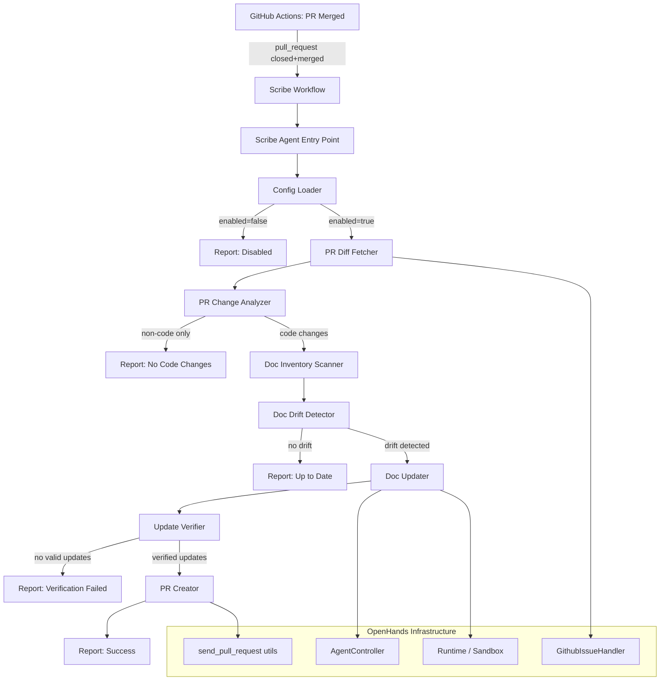

# Design Document: Scribe (Autonomous Documentation Sync)

## Overview

Scribe adds an autonomous documentation sync agent to the Nunzi platform (built on OpenHands). It follows the same architectural pattern as the existing `openhands/resolver/` module (which resolves GitHub issues) but targets documentation drift instead. When a pull request is merged, Scribe analyzes the code diff, detects which documentation files have drifted out of sync, generates updates using the OpenHands agent controller, verifies the updates for structural correctness, and opens a new PR with the changes.

The implementation lives in a new `openhands/scribe/` module and a companion GitHub Actions workflow. It reuses the existing `Runtime`, `AgentController`, `GithubIssueHandler`, and `send_pull_request` infrastructure.

## Architecture



## Components and Interfaces

### 1. Scribe Workflow (`scribe-doc-sync.yml`)

A GitHub Actions reusable workflow triggered by `pull_request` events with `types: [closed]` and a condition checking `github.event.pull_request.merged == true`. It installs OpenHands, invokes the Scribe entry point, and uploads the output artifact.

**Inputs**: `max_iterations`, `LLM_MODEL`
**Secrets**: `LLM_API_KEY`, `PAT_TOKEN`

### 2. Scribe Agent Entry Point (`openhands/scribe/resolve_docs.py`)

The CLI entry point, analogous to `openhands/resolver/resolve_issue.py`. Parses arguments, orchestrates the full documentation sync pipeline, and writes output.

```python
class ScribeAgent:
    def __init__(self, config: ScribeConfig, token: str, repo: str) -> None: ...
    async def run(self, pr_number: int) -> ScribeOutput: ...
```

**Arguments**: `--repo`, `--pr-number`, `--token`, `--max-iterations`, `--llm-model`, `--output-dir`

### 3. Config Loader (`openhands/scribe/config.py`)

Loads and validates `.scribe.yml` from the repository root. Falls back to defaults when the file is missing or invalid.

```python
@dataclass
class ScribeConfig:
    enabled: bool = True
    doc_paths: list[str] = field(default_factory=lambda: [
        "README.md", "**/README.md", "docs/**/*.md",
        "**/openapi.json", "**/openapi.yaml", "**/swagger.json"
    ])
    ignore_paths: list[str] = field(default_factory=list)
    max_iterations: int = 30
    doc_mappings: dict[str, list[str]] = field(default_factory=dict)

    @classmethod
    def load(cls, repo_dir: str) -> "ScribeConfig": ...
    def to_dict(self) -> dict: ...
    @classmethod
    def from_dict(cls, data: dict) -> "ScribeConfig": ...
```

### 4. PR Change Analyzer (`openhands/scribe/change_analyzer.py`)

Parses a unified diff into a structured `ChangeSummary`. Uses tree-sitter or regex-based heuristics to identify function/class/endpoint changes from the diff hunks.

```python
class ChangeType(str, Enum):
    ENDPOINT_CHANGE = "endpoint_change"
    FUNCTION_SIGNATURE_CHANGE = "function_signature_change"
    CLASS_CHANGE = "class_change"
    CONFIG_CHANGE = "config_change"
    DEPENDENCY_CHANGE = "dependency_change"
    OTHER = "other"

@dataclass
class ChangeEntry:
    file_path: str
    change_type: ChangeType
    name: str  # function/class/endpoint name
    description: str  # human-readable summary

class ChangeSummary(BaseModel):
    pr_number: int
    entries: list[ChangeEntry]
    affected_files: list[str]
    has_code_changes: bool

    def to_json(self) -> str: ...
    @classmethod
    def from_json(cls, json_str: str) -> "ChangeSummary": ...
```

**Diff parsing strategy**: Parse unified diff format, extract file paths and hunks. For Python files, use regex to detect function/class definitions in added/removed lines. For route decorators (`@app.route`, `@router.get`, etc.), detect endpoint changes. For `requirements.txt`/`pyproject.toml`/`package.json`, detect dependency changes.

### 5. Doc Inventory Scanner (`openhands/scribe/doc_inventory.py`)

Scans the repository file tree for documentation files matching the configured glob patterns.

```python
class DocFile:
    path: str
    doc_type: DocType  # OPENAPI, MARKDOWN, MERMAID_MARKDOWN, README

class DocInventory:
    def __init__(self, repo_dir: str, config: ScribeConfig) -> None: ...
    def scan(self) -> list[DocFile]: ...
```

### 6. Doc Drift Detector (`openhands/scribe/drift_detector.py`)

Compares the `ChangeSummary` against the `DocInventory` to find documentation files that reference changed code elements.

```python
@dataclass
class DriftEntry:
    doc_file: str
    stale_sections: list[str]
    reason: str
    related_changes: list[ChangeEntry]

class DriftReport(BaseModel):
    pr_number: int
    entries: list[DriftEntry]

    def to_json(self) -> str: ...
    @classmethod
    def from_json(cls, json_str: str) -> "DriftReport": ...

class DocDriftDetector:
    def __init__(self, config: ScribeConfig) -> None: ...
    def detect(self, inventory: list[DocFile], changes: ChangeSummary) -> DriftReport: ...
```

**Detection strategy**: For each doc file, read its content and check if it references any changed element names (function names, endpoint paths, class names). For `doc_mappings`, directly map source paths to doc files. For OpenAPI specs, check if any changed endpoints appear in the spec's paths.

### 7. Doc Updater (`openhands/scribe/doc_updater.py`)

Uses the OpenHands agent controller to generate documentation updates.

```python
@dataclass
class DocUpdate:
    file_path: str
    original_content: str
    updated_content: str
    change_description: str

class DocUpdater:
    def __init__(self, config: ScribeConfig, llm_config: LLMConfig) -> None: ...
    async def generate_updates(
        self, drift_report: DriftReport, change_summary: ChangeSummary, repo_dir: str
    ) -> list[DocUpdate]: ...
```

**Prompt construction**: The agent receives a structured prompt containing:
1. The Drift_Report (which files are stale and why)
2. The current content of the stale documentation file
3. The relevant source code files (from the change summary)
4. The Change_Summary (what changed)
5. Instructions specific to the doc type (OpenAPI schema rules, Mermaid syntax rules, Markdown structure preservation)

### 8. Update Verifier (`openhands/scribe/verifier.py`)

Validates generated documentation updates for structural correctness.

```python
@dataclass
class VerificationResult:
    file_path: str
    is_valid: bool
    errors: list[str]

class UpdateVerifier:
    def verify_openapi(self, content: str) -> VerificationResult: ...
    def verify_mermaid(self, content: str) -> VerificationResult: ...
    def verify_markdown(self, content: str) -> VerificationResult: ...
    def verify_all(self, updates: list[DocUpdate]) -> list[DocUpdate]: ...
```

**Verification strategies**:
- OpenAPI: Parse with `jsonschema` or `openapi-spec-validator` against OpenAPI 3.x schema
- Mermaid: Extract fenced code blocks tagged `mermaid`, validate basic syntax (graph/flowchart/sequenceDiagram declarations, balanced brackets)
- Markdown: Parse with a Markdown parser, check that all `[text](#heading)` links resolve to actual headings in the document

### 9. PR Creator (`openhands/scribe/pr_creator.py`)

Creates a branch, commits updates, and opens a PR. Reuses `send_pull_request` utilities from `openhands/resolver/`.

```python
class PRCreator:
    def __init__(self, token: str, repo: str) -> None: ...
    async def create_doc_pr(
        self, pr_number: int, updates: list[DocUpdate], repo_dir: str
    ) -> PRResult: ...
```

**Branch naming**: `docs/scribe-sync-{pr_number}`
**Commit message**: `docs: sync documentation with PR #{pr_number}`
**PR title**: `docs: sync documentation with recent changes (#{pr_number})`
**PR body**: Lists each updated file with a brief description of what changed, references the original PR.

## Data Models

```python
from enum import Enum
from pydantic import BaseModel
from dataclasses import dataclass, field

class ChangeType(str, Enum):
    ENDPOINT_CHANGE = "endpoint_change"
    FUNCTION_SIGNATURE_CHANGE = "function_signature_change"
    CLASS_CHANGE = "class_change"
    CONFIG_CHANGE = "config_change"
    DEPENDENCY_CHANGE = "dependency_change"
    OTHER = "other"

class DocType(str, Enum):
    OPENAPI = "openapi"
    MARKDOWN = "markdown"
    MERMAID_MARKDOWN = "mermaid_markdown"
    README = "readme"

class ChangeEntry(BaseModel):
    file_path: str
    change_type: ChangeType
    name: str
    description: str

class ChangeSummary(BaseModel):
    pr_number: int
    entries: list[ChangeEntry]
    affected_files: list[str]
    has_code_changes: bool

class DocFile(BaseModel):
    path: str
    doc_type: DocType

class DriftEntry(BaseModel):
    doc_file: str
    stale_sections: list[str]
    reason: str
    related_changes: list[ChangeEntry]

class DriftReport(BaseModel):
    pr_number: int
    entries: list[DriftEntry]

class DocUpdate(BaseModel):
    file_path: str
    original_content: str
    updated_content: str
    change_description: str

class VerificationResult(BaseModel):
    file_path: str
    is_valid: bool
    errors: list[str]

class PRResult(BaseModel):
    branch_name: str
    commit_sha: str
    pr_url: str
    pr_number: int

class ScribeOutput(BaseModel):
    source_pr_number: int
    files_analyzed: int
    drift_detected: int
    updates_generated: int
    updates_verified: int
    pr_created: bool
    pr_url: str | None
    skip_reason: str | None
    errors: list[str]
```

## Correctness Properties

*A property is a characteristic or behavior that should hold true across all valid executions of a system — essentially, a formal statement about what the system should do. Properties serve as the bridge between human-readable specifications and machine-verifiable correctness guarantees.*


### Property 1: Change_Summary round-trip serialization

*For any* valid `ChangeSummary` object, serializing it to JSON and then deserializing the JSON back should produce an equivalent `ChangeSummary` object.

**Validates: Requirements 2.3, 2.4**

### Property 2: Drift_Report round-trip serialization

*For any* valid `DriftReport` object, serializing it to JSON and then deserializing the JSON back should produce an equivalent `DriftReport` object.

**Validates: Requirements 3.4, 3.5**

### Property 3: Scribe_Output round-trip serialization

*For any* valid `ScribeOutput` object, serializing it to JSON and then deserializing the JSON back should produce an equivalent `ScribeOutput` object.

**Validates: Requirements 8.4**

### Property 4: Doc_Inventory respects configured patterns

*For any* set of file paths in a repository and any set of glob patterns in the `ScribeConfig.doc_paths`, the `DocInventory.scan()` result should contain exactly the files matching at least one of the configured patterns and none of the files matching `ignore_paths`.

**Validates: Requirements 3.1, 3.7**

### Property 5: Drift detection identifies docs referencing changed elements

*For any* documentation file that textually references a code element name present in the `ChangeSummary`, the `DocDriftDetector.detect()` should include that documentation file in the `DriftReport`.

**Validates: Requirements 3.2**

### Property 6: Doc_mappings prioritize drift detection

*For any* `ScribeConfig` with a `doc_mappings` entry mapping a source path pattern to documentation files, and any `ChangeSummary` containing a change in a file matching that pattern, the `DriftReport` should include the mapped documentation files.

**Validates: Requirements 7.5**

### Property 7: Update context includes all required elements

*For any* call to `DocUpdater.generate_updates()`, the prompt constructed for the agent should contain the Drift_Report, the current documentation file content, the relevant source code files, and the Change_Summary.

**Validates: Requirements 4.2**

### Property 8: Updates constrained to Drift_Report files

*For any* set of `DocUpdate` objects produced by `DocUpdater.generate_updates()`, every `DocUpdate.file_path` should be present in the `DriftReport.entries` file list.

**Validates: Requirements 4.7**

### Property 9: OpenAPI verification rejects invalid specs

*For any* string that is not valid OpenAPI 3.x JSON/YAML, `UpdateVerifier.verify_openapi()` should return `is_valid=False`.

**Validates: Requirements 5.1**

### Property 10: Mermaid verification validates syntax

*For any* Markdown string containing fenced `mermaid` code blocks, `UpdateVerifier.verify_mermaid()` should return `is_valid=True` only if all Mermaid blocks contain parseable Mermaid syntax (valid diagram type declaration and balanced delimiters).

**Validates: Requirements 5.2**

### Property 11: Markdown internal link verification

*For any* Markdown string containing internal heading links (`[text](#heading-slug)`), `UpdateVerifier.verify_markdown()` should return `is_valid=True` only if every linked heading slug corresponds to an actual heading in the document.

**Validates: Requirements 5.3**

### Property 12: Verified updates are subset of input updates

*For any* list of `DocUpdate` objects passed to `UpdateVerifier.verify_all()`, the returned list should be a subset of the input list (only valid updates are kept).

**Validates: Requirements 5.5**

### Property 13: PR naming conventions

*For any* PR number, the `PRCreator` should produce a branch name matching `docs/scribe-sync-{pr_number}`, a commit message matching `docs: sync documentation with PR #{pr_number}`, and a PR title matching `docs: sync documentation with recent changes (#{pr_number})`.

**Validates: Requirements 6.1, 6.2, 6.3**

### Property 14: PR body contains all updated files and original PR reference

*For any* set of verified `DocUpdate` objects and source PR number, the generated PR body should contain every updated file path and a reference to the original PR number.

**Validates: Requirements 6.4**

### Property 15: Config fields parsed correctly with defaults

*For any* valid `.scribe.yml` YAML string, `ScribeConfig.load()` should parse all supported fields (`doc_paths`, `ignore_paths`, `max_iterations`, `doc_mappings`, `enabled`). For missing fields, the config should use default values (`enabled=True`, `max_iterations=30`, default `doc_paths`).

**Validates: Requirements 7.1, 7.2, 7.3, 7.4, 7.6**

### Property 16: README structure preservation

*For any* README update, the set of Markdown headings in the updated content that are not related to detected changes should be identical to the corresponding headings in the original content.

**Validates: Requirements 4.5**

### Property 17: Diff parsing produces complete Change_Summary

*For any* unified diff containing function additions, removals, or modifications, the `PR_Change_Analyzer` should produce a `ChangeSummary` where every changed function/endpoint/class in the diff appears as a `ChangeEntry`.

**Validates: Requirements 2.1**

## Error Handling

| Scenario | Component | Behavior |
|---|---|---|
| GitHub API unreachable | ScribeAgent | Log error, terminate gracefully, write ScribeOutput with error |
| No `.scribe.yml` found | ConfigLoader | Use default config, continue |
| Invalid `.scribe.yml` | ConfigLoader | Log warning, use default config, continue |
| PR diff contains only non-code files | PR_Change_Analyzer | Set `has_code_changes=False`, agent skips |
| No documentation drift detected | DocDriftDetector | Return empty DriftReport, agent skips |
| Agent exceeds max iterations | DocUpdater | Skip that file, continue with remaining |
| Update fails verification | UpdateVerifier | Discard update, log errors, continue |
| No updates pass verification | ScribeAgent | Skip PR creation, log reason |
| Branch already exists | PRCreator | Append timestamp suffix to branch name |
| PR creation fails | PRCreator | Log error, write ScribeOutput with error |

## Testing Strategy

### Property-Based Testing

Use `hypothesis` (Python) for property-based testing. Each property test should run a minimum of 100 iterations.

Each property-based test must be tagged with a comment:
```python
# Feature: autonomous-documentation-sync, Property N: <property_text>
```

Property tests cover:
- Round-trip serialization for all data models (Properties 1, 2, 3)
- Doc inventory pattern matching (Property 4)
- Drift detection correctness (Properties 5, 6)
- Update constraint enforcement (Properties 8, 12)
- Verification correctness (Properties 9, 10, 11)
- PR naming conventions (Properties 13, 14)
- Config parsing with defaults (Property 15)

### Unit Testing

Use `pytest` for unit tests. Unit tests complement property tests by covering:
- Specific diff parsing examples (pytest tracebacks, ruff output, endpoint decorators)
- Config loading edge cases (missing file, invalid YAML, partial config)
- Error handling paths (API failures, timeout, disabled config)
- Mermaid syntax validation with known valid/invalid examples
- OpenAPI validation with known valid/invalid specs
- PR body formatting with specific examples

### Test Organization

```
tests/unit/test_scribe/
├── test_models.py          # Property tests for round-trip serialization (P1, P2, P3)
├── test_config.py          # Property test for config parsing (P15) + unit tests
├── test_change_analyzer.py # Property test for diff parsing (P17) + unit tests
├── test_doc_inventory.py   # Property test for pattern matching (P4)
├── test_drift_detector.py  # Property tests for drift detection (P5, P6)
├── test_doc_updater.py     # Property tests for context/constraints (P7, P8, P16)
├── test_verifier.py        # Property tests for verification (P9, P10, P11, P12)
└── test_pr_creator.py      # Property tests for PR formatting (P13, P14)
```
