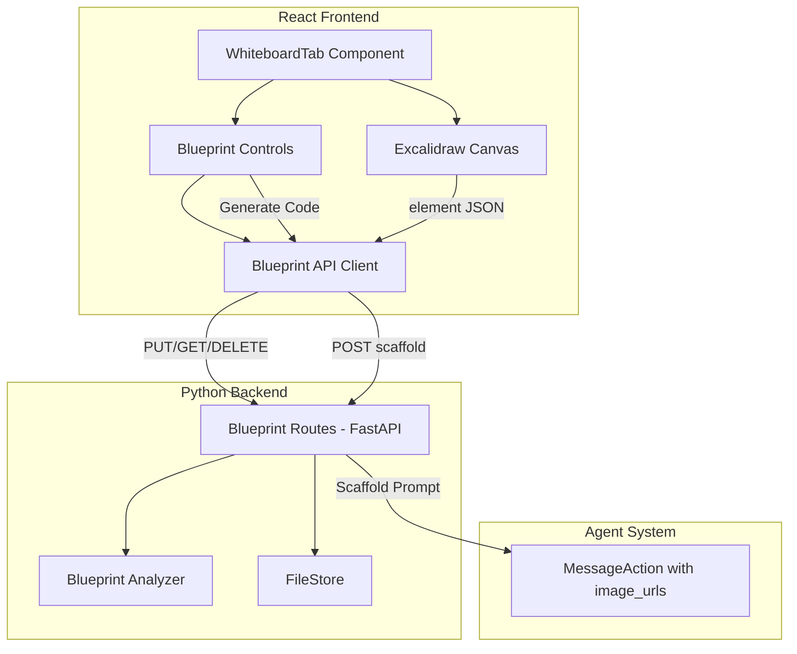

# Design Document: Blueprint Whiteboard-to-Code

## Overview

Project Blueprint adds an Excalidraw-based whiteboard canvas to the OpenHands conversation UI. Users draw architecture diagrams or UI wireframes, and the system analyzes the vector data to produce a structured description that the AI agent uses to scaffold project code. The feature integrates as a new tab in the existing conversation tab system, with backend API endpoints for persisting and retrieving blueprint data via the existing `FileStore` abstraction.

Key design decisions:
- **Excalidraw as the drawing engine**: Mature, open-source, React-native library with a well-defined element schema. Avoids building a custom canvas.
- **Tab-based integration**: The whiteboard is a new tab in `ConversationTabs`, consistent with how terminal, browser, and editor views are accessed.
- **Backend-driven analysis**: The Blueprint Analyzer runs server-side in Python, parsing Excalidraw's JSON element array into a structured graph of nodes and edges. This keeps the frontend thin and allows the analysis logic to evolve independently.
- **Existing storage**: Blueprints are stored using the existing `FileStore` abstraction under a conversation-scoped path, avoiding new storage infrastructure.

## Architecture



The frontend embeds Excalidraw inside a new `WhiteboardTab` component rendered within the existing `ConversationTabContent`. The tab communicates with three backend endpoints for CRUD operations on blueprints. When the user triggers code generation, the frontend exports a PNG snapshot, the backend runs the Blueprint Analyzer on the element JSON, and a `MessageAction` is dispatched to the agent with both the structured description and the image.

## Components and Interfaces

### Frontend Components

#### `WhiteboardTab` (`frontend/src/components/features/whiteboard/whiteboard-tab.tsx`)
Top-level component rendered when the "whiteboard" tab is selected. Manages Excalidraw state, auto-save debouncing, and blueprint loading.

```typescript
interface WhiteboardTabProps {
  conversationId: string;
}

// Internal state
interface WhiteboardState {
  elements: ExcalidrawElement[];
  isDirty: boolean;
  isSaving: boolean;
  isLoading: boolean;
}
```

#### `BlueprintControls` (`frontend/src/components/features/whiteboard/blueprint-controls.tsx`)
Toolbar overlay on the whiteboard with "Generate Code" and "Clear Canvas" buttons.

```typescript
interface BlueprintControlsProps {
  hasElements: boolean;
  isGenerating: boolean;
  onGenerate: () => void;
  onClear: () => void;
}
```

#### Tab Registration
A new entry is added to the `tabs` array in `conversation-tabs.tsx`:

```typescript
{
  tabValue: "whiteboard",
  isActive: isTabActive("whiteboard"),
  icon: WhiteboardIcon, // new SVG icon
  onClick: () => selectTab("whiteboard"),
  tooltipContent: t(I18nKey.COMMON$WHITEBOARD),
  tooltipAriaLabel: t(I18nKey.COMMON$WHITEBOARD),
  label: t(I18nKey.COMMON$WHITEBOARD),
}
```

### Frontend API Client

#### `BlueprintService` (`frontend/src/api/blueprint-service.ts`)
Follows the existing API service pattern (like `ConversationService`).

```typescript
class BlueprintService {
  static async saveBlueprint(
    conversationId: string,
    elements: ExcalidrawElement[],
    pngDataUrl: string
  ): Promise<void>;

  static async getBlueprint(
    conversationId: string
  ): Promise<BlueprintData | null>;

  static async deleteBlueprint(
    conversationId: string
  ): Promise<void>;

  static async generateCode(
    conversationId: string,
    elements: ExcalidrawElement[],
    pngDataUrl: string
  ): Promise<void>;
}

interface BlueprintData {
  elements: ExcalidrawElement[];
  pngUrl: string;
}
```

### TanStack Query Hooks

Following the project's data fetching architecture:

```typescript
// frontend/src/hooks/query/use-blueprint.ts
function useBlueprint(conversationId: string): UseQueryResult<BlueprintData | null>;

// frontend/src/hooks/mutation/use-save-blueprint.ts
function useSaveBlueprint(): UseMutationResult<void, Error, SaveBlueprintParams>;

// frontend/src/hooks/mutation/use-delete-blueprint.ts
function useDeleteBlueprint(): UseMutationResult<void, Error, string>;

// frontend/src/hooks/mutation/use-generate-code.ts
function useGenerateCode(): UseMutationResult<void, Error, GenerateCodeParams>;
```

### Backend Components

#### Blueprint Routes (`openhands/server/routes/blueprint.py`)
FastAPI router registered in `app.py`, following the same pattern as other route modules.

```python
from fastapi import APIRouter
app = APIRouter(prefix="/api", tags=["blueprint"])

class BlueprintSaveRequest(BaseModel):
    elements: list[dict]  # Excalidraw element JSON
    png_base64: str       # Base64-encoded PNG snapshot

class BlueprintResponse(BaseModel):
    elements: list[dict]
    png_url: str

class AnalysisResult(BaseModel):
    nodes: list[NodeDescription]
    edges: list[EdgeDescription]
    warnings: list[str]

@app.put("/conversations/{conversation_id}/blueprint")
async def save_blueprint(conversation_id: str, request: BlueprintSaveRequest) -> None: ...

@app.get("/conversations/{conversation_id}/blueprint")
async def get_blueprint(conversation_id: str) -> BlueprintResponse | None: ...

@app.delete("/conversations/{conversation_id}/blueprint")
async def delete_blueprint(conversation_id: str) -> None: ...

@app.post("/conversations/{conversation_id}/blueprint/generate")
async def generate_code(conversation_id: str, request: BlueprintSaveRequest) -> None: ...
```

#### Blueprint Analyzer (`openhands/server/services/blueprint_analyzer.py`)
Pure function that converts Excalidraw element arrays into structured graph descriptions.

```python
@dataclass
class NodeDescription:
    id: str
    name: str
    node_type: str        # "service", "database", "ui_component", "generic"
    technology: str | None
    shape: str            # "rectangle", "ellipse", "diamond"

@dataclass
class EdgeDescription:
    source_id: str
    target_id: str
    label: str | None

@dataclass
class BlueprintAnalysis:
    nodes: list[NodeDescription]
    edges: list[EdgeDescription]
    warnings: list[str]

def analyze_blueprint(elements: list[dict]) -> BlueprintAnalysis: ...
def serialize_analysis(analysis: BlueprintAnalysis) -> str: ...
def deserialize_analysis(json_str: str) -> BlueprintAnalysis: ...
def build_scaffold_prompt(analysis: BlueprintAnalysis) -> str: ...
```

#### Blueprint Storage
Blueprints are stored using the existing `FileStore` under conversation-scoped paths:

```
sessions/{conversation_id}/blueprint/elements.json
sessions/{conversation_id}/blueprint/snapshot.png
```

## Data Models

### Excalidraw Element (External — from `@excalidraw/excalidraw`)
The canonical element schema is defined by the Excalidraw library. Key fields used by the analyzer:

```typescript
interface ExcalidrawElement {
  id: string;
  type: "rectangle" | "ellipse" | "diamond" | "arrow" | "line" | "text" | "freedraw";
  x: number;
  y: number;
  width: number;
  height: number;
  boundElements?: Array<{ id: string; type: string }>;
  containerId?: string | null;
  text?: string;           // for text elements
  startBinding?: { elementId: string } | null;  // for arrows
  endBinding?: { elementId: string } | null;    // for arrows
}
```

### BlueprintAnalysis (Backend)

```python
class BlueprintAnalysis:
    nodes: list[NodeDescription]
    edges: list[EdgeDescription]
    warnings: list[str]
```

Serialized as JSON:
```json
{
  "nodes": [
    {
      "id": "abc123",
      "name": "Auth Service",
      "node_type": "service",
      "technology": "FastAPI",
      "shape": "rectangle"
    }
  ],
  "edges": [
    {
      "source_id": "abc123",
      "target_id": "def456",
      "label": "REST API"
    }
  ],
  "warnings": [
    "Element 'Rectangle_3' has no text label, assigned default name"
  ]
}
```

### Scaffold Prompt Format
The prompt sent to the agent as a `MessageAction`:

```
You are analyzing a system architecture diagram. Based on the following structured description and the attached image, scaffold the project.

## Architecture Description
{serialized BlueprintAnalysis JSON}

## Warnings
{list of warnings, if any}

## Instructions
- Create a directory structure matching the identified services/components
- Generate docker-compose.yml if multiple services are present
- Create stub implementations for each service with the identified technology
- Generate basic React components for any UI elements identified
- Include README.md with architecture overview
```


## Correctness Properties

*A property is a characteristic or behavior that should hold true across all valid executions of a system — essentially, a formal statement about what the system should do. Properties serve as the bridge between human-readable specifications and machine-verifiable correctness guarantees.*

### Property 1: Debounce coalesces rapid saves

*For any* sequence of N canvas change events occurring within a 2-second window, the system should trigger exactly one save operation after the debounce interval elapses, not N saves.

**Validates: Requirements 2.1**

### Property 2: Blueprint persistence round trip

*For any* valid Excalidraw element array and PNG snapshot, saving a Blueprint to the backend and then retrieving it should produce an element array equivalent to the original.

**Validates: Requirements 2.2, 2.4**

### Property 3: Analyzer extracts nodes and edges from elements

*For any* valid Excalidraw element array containing shape elements (rectangles, ellipses, diamonds) with or without text labels, and arrow elements with bindings, the Blueprint Analyzer should produce a `BlueprintAnalysis` where: (a) every shape element maps to exactly one node with a name (either from its text label or a default name like "Shape_N"), (b) every arrow with both start and end bindings maps to exactly one edge, and (c) the total node count equals the number of shape elements.

**Validates: Requirements 3.1, 3.3, 3.4**

### Property 4: Annotation parsing extracts name and technology

*For any* string matching the pattern `"Name (Technology)"`, the annotation parser should extract the name as the text before the parentheses (trimmed) and the technology as the text inside the parentheses. For strings without parentheses, the entire string should be the name and technology should be null.

**Validates: Requirements 3.2**

### Property 5: Disconnected arrows produce warnings

*For any* Excalidraw arrow element where `startBinding` or `endBinding` is null, the Blueprint Analyzer should omit that arrow from the edges list and include a warning string referencing that arrow's ID in the warnings list.

**Validates: Requirements 3.5**

### Property 6: Analysis serialization round trip

*For any* valid `BlueprintAnalysis` object, serializing it to JSON and then deserializing the JSON string back should produce a `BlueprintAnalysis` equivalent to the original.

**Validates: Requirements 3.6**

### Property 7: Scaffold prompt contains all required parts

*For any* valid `BlueprintAnalysis` (with or without warnings) and any image URL string, the generated scaffold prompt should contain: (a) the serialized JSON description, (b) the image URL, (c) a system instruction for scaffolding, and (d) all warning strings from the analysis if any exist.

**Validates: Requirements 4.2, 4.4**

### Property 8: Generate button enabled iff canvas has elements

*For any* Excalidraw element array, the "Generate Code" button should be enabled if and only if the array contains at least one element.

**Validates: Requirements 6.1, 6.2**

### Property 9: Tab switching preserves whiteboard state

*For any* whiteboard state with N elements, switching from the whiteboard tab to another tab and back should result in the whiteboard containing the same N elements with identical data.

**Validates: Requirements 7.2, 7.3**

## Error Handling

| Scenario | Behavior | HTTP Status |
|---|---|---|
| Save fails due to network error | Display error toast, retain elements in memory | N/A (frontend) |
| GET blueprint for nonexistent conversation | Return 404 with error message | 404 |
| PUT with malformed element JSON | Return 422 with validation details | 422 |
| DELETE for nonexistent blueprint | Return 404 | 404 |
| Blueprint Analyzer encounters unlabeled element | Assign default name, add warning | N/A (logic) |
| Blueprint Analyzer encounters disconnected arrow | Omit from edges, add warning | N/A (logic) |
| Excalidraw library fails to load | Display error message in tab area, disable controls | N/A (frontend) |
| PNG export fails | Display error toast, abort generation | N/A (frontend) |

Error responses follow the existing OpenHands pattern — JSON body with a descriptive message field.

## Testing Strategy

### Property-Based Tests (using Hypothesis for Python, fast-check for TypeScript)

Each correctness property is implemented as a single property-based test with a minimum of 100 iterations. Tests are tagged with the format: `Feature: blueprint-whiteboard, Property N: <title>`.

**Backend (Python — Hypothesis)**:
- Property 2: Blueprint persistence round trip (generate random element arrays, save/load via in-memory FileStore)
- Property 3: Analyzer node/edge extraction (generate random Excalidraw element arrays with shapes and arrows)
- Property 4: Annotation parsing (generate random "Name (Tech)" strings and plain strings)
- Property 5: Disconnected arrow warnings (generate arrow elements with null bindings)
- Property 6: Analysis serialization round trip (generate random BlueprintAnalysis objects)
- Property 7: Scaffold prompt completeness (generate random analyses with/without warnings)

**Frontend (TypeScript — fast-check)**:
- Property 1: Debounce coalescing (generate random sequences of change events with timestamps)
- Property 8: Button enabled state (generate random element arrays including empty)
- Property 9: Tab switch state preservation (generate random element arrays, simulate tab switches)

### Unit Tests

Unit tests cover specific examples, edge cases, and error conditions:

**Backend**:
- Blueprint API endpoints: test 404 for invalid conversation, 422 for malformed JSON, successful CRUD cycle
- Analyzer: test specific diagram (e.g., "Auth Service (FastAPI)" → rectangle → "Users DB (Postgres)" cylinder)
- Annotation parser: test edge cases like empty string, multiple parentheses, nested parens

**Frontend**:
- WhiteboardTab: renders Excalidraw, shows placeholder when empty, loads saved blueprint
- BlueprintControls: button disabled when no elements, loading state during generation
- Navigation: tab switches to chat after generation completes
- Error handling: toast shown on save failure

### Test Configuration

- Backend: `pytest` with `hypothesis` plugin, tests in `tests/unit/test_blueprint_analyzer.py` and `tests/unit/test_blueprint_routes.py`
- Frontend: `vitest` with `fast-check`, tests in `frontend/src/components/features/whiteboard/__tests__/`
- Property tests: minimum 100 iterations each
- Each property test references its design document property number in a comment tag
