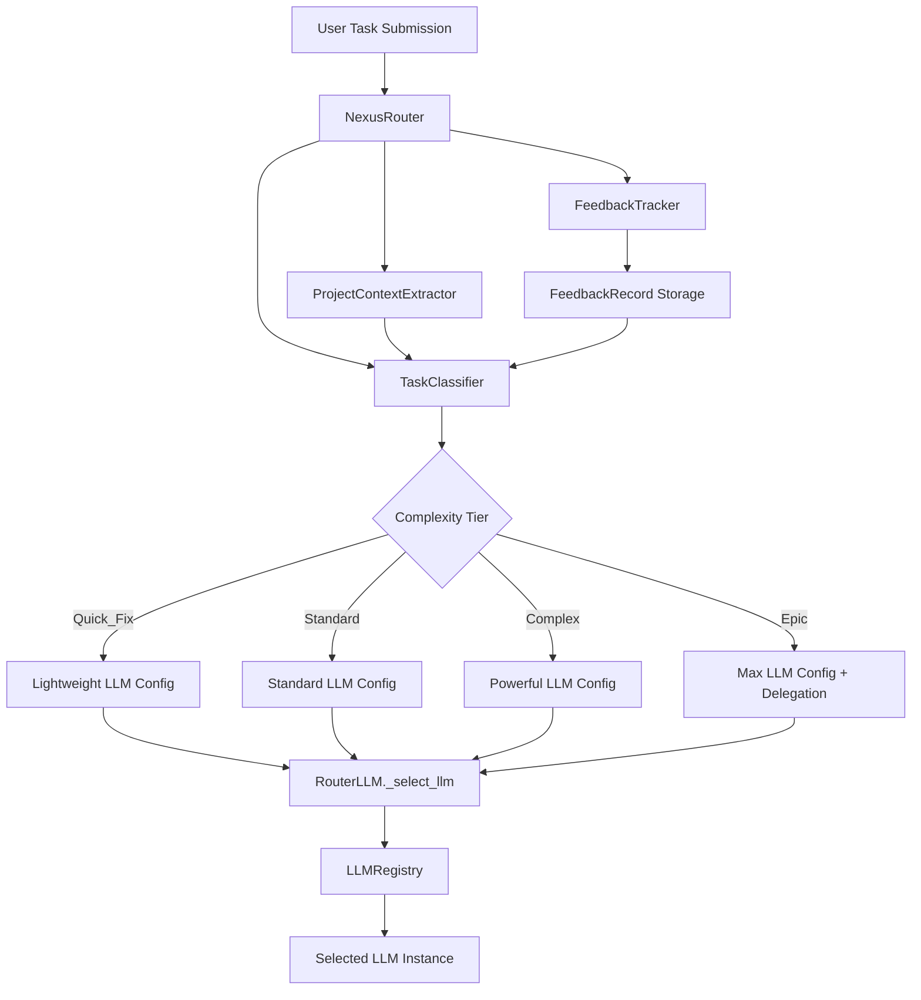
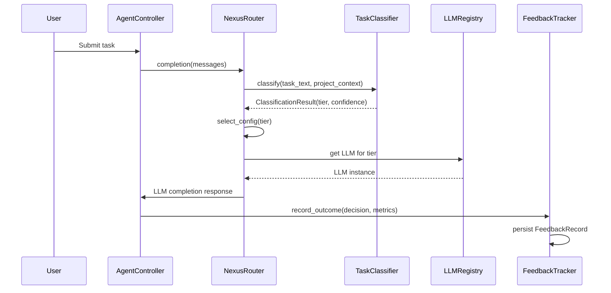

# Design Document: Nexus Smart Routing

## Overview

Nexus is a task-complexity-aware routing layer that sits between user task submission and agent execution in the Nunzi/OpenHands platform. It extends the existing `RouterLLM` infrastructure to classify incoming tasks into complexity tiers and select optimal agent configurations accordingly.

The system consists of three main components:
1. A **Task Classifier** that analyzes task descriptions using keyword heuristics and optional LLM-based analysis to produce a complexity tier and confidence score.
2. A **Configuration Selector** that maps complexity tiers to pre-defined agent configurations (model, iterations, delegation settings).
3. A **Feedback Tracker** that records task outcomes to enable future routing improvements.

Nexus integrates with the existing `RouterLLM` base class, `LLMRegistry`, and `ModelRoutingConfig` so it can be activated via standard OpenHands configuration without changes to the agent controller or session management.

## Architecture





## Components and Interfaces

### 1. ComplexityTier (Enum)

```python
from enum import Enum

class ComplexityTier(str, Enum):
    QUICK_FIX = "quick_fix"
    STANDARD = "standard"
    COMPLEX = "complex"
    EPIC = "epic"
```

Ordered by increasing complexity. Supports comparison for tier bumping logic.

### 2. ClassificationResult (Data Model)

```python
from pydantic import BaseModel, Field

class ClassificationResult(BaseModel):
    tier: ComplexityTier
    confidence: float = Field(ge=0.0, le=1.0)
    explanation: str
```

### 3. TaskClassifier

Responsible for analyzing task text and producing a `ClassificationResult`.

```python
class TaskClassifier:
    QUICK_FIX_KEYWORDS: list[str]
    EPIC_KEYWORDS: list[str]
    MULTI_FILE_PATTERNS: list[str]

    def classify(self, task_text: str, project_context: ProjectContext | None = None) -> ClassificationResult:
        """Classify task text into a ComplexityTier with confidence."""
        ...

    def _keyword_score(self, task_text: str) -> dict[ComplexityTier, float]:
        """Score task text against keyword lists for each tier."""
        ...

    def _apply_context_adjustment(self, result: ClassificationResult, context: ProjectContext) -> ClassificationResult:
        """Bump tier if project context indicates large codebase."""
        ...
```

**Classification Strategy (Rule-Based)**:
1. Normalize and tokenize the task description.
2. Score against keyword lists for each tier.
3. Select the tier with the highest score. If no tier scores above a threshold, default to Standard with confidence < 0.5.
4. Apply project context adjustments (large codebase bumps tier up by one).
5. If confidence < 0.5, override tier to Standard.

**Keyword Lists**:
- `QUICK_FIX_KEYWORDS`: "rename", "typo", "fix spelling", "change name", "update string", "fix whitespace", "correct typo"
- `EPIC_KEYWORDS`: "architecture", "migration", "restructure", "large-scale", "redesign", "rewrite entire", "migrate"
- `MULTI_FILE_PATTERNS`: patterns matching multiple file references, "across modules", "all files in", "refactor module"

### 4. ProjectContext (Data Model)

```python
class ProjectContext(BaseModel):
    language: str | None = None
    framework: str | None = None
    estimated_lines: int | None = None

    @property
    def is_large_codebase(self) -> bool:
        return self.estimated_lines is not None and self.estimated_lines > 100_000
```

### 5. TierConfigMapping (Data Model)

Maps each `ComplexityTier` to an LLM config key name (referencing entries in `llms_for_routing`).

```python
class TierConfigMapping(BaseModel):
    quick_fix: str = "quick_fix_model"
    standard: str = "standard_model"
    complex: str = "complex_model"
    epic: str = "epic_model"

    def get_llm_key(self, tier: ComplexityTier) -> str:
        return getattr(self, tier.value)
```

### 6. RoutingDecision (Data Model)

```python
class RoutingDecision(BaseModel):
    task_id: str
    tier: ComplexityTier
    confidence: float = Field(ge=0.0, le=1.0)
    selected_model: str
    explanation: str
```

### 7. FeedbackRecord (Data Model)

```python
class FeedbackRecord(BaseModel):
    task_id: str
    routing_decision: RoutingDecision
    actual_cost: float
    actual_duration_seconds: float
    success: bool
    timestamp: datetime
```

### 8. FeedbackTracker

```python
class FeedbackTracker:
    def __init__(self, storage_path: str):
        ...

    def record(self, feedback: FeedbackRecord) -> None:
        """Persist a feedback record. Logs and continues on storage failure."""
        ...

    def get_history(self, limit: int = 100) -> list[FeedbackRecord]:
        """Retrieve recent feedback records."""
        ...
```

### 9. NexusRouter (RouterLLM subclass)

```python
class NexusRouter(RouterLLM):
    ROUTER_NAME = "nexus_router"

    def __init__(self, agent_config: AgentConfig, llm_registry: LLMRegistry, **kwargs):
        super().__init__(agent_config, llm_registry, **kwargs)
        self.classifier = TaskClassifier()
        self.tier_mapping = TierConfigMapping()
        self.feedback_tracker = FeedbackTracker(...)
        self._current_decision: RoutingDecision | None = None

    def _select_llm(self, messages: list[Message]) -> str:
        """Select LLM based on task classification."""
        task_text = self._extract_task_text(messages)
        classification = self.classifier.classify(task_text)
        llm_key = self.tier_mapping.get_llm_key(classification.tier)

        # Fall back to primary if the selected key is not available
        if llm_key not in self.available_llms:
            llm_key = "primary"

        self._current_decision = RoutingDecision(
            task_id=...,
            tier=classification.tier,
            confidence=classification.confidence,
            selected_model=self.available_llms[llm_key].config.model,
            explanation=classification.explanation,
        )
        return llm_key

    def _extract_task_text(self, messages: list[Message]) -> str:
        """Extract the user's task description from the first user message."""
        ...
```

Registered via:
```python
ROUTER_LLM_REGISTRY[NexusRouter.ROUTER_NAME] = NexusRouter
```

## Data Models

All data models use Pydantic `BaseModel` for automatic JSON serialization/deserialization.

| Model | Fields | Serialization |
|---|---|---|
| `ComplexityTier` | Enum: quick_fix, standard, complex, epic | String value |
| `ClassificationResult` | tier, confidence, explanation | JSON via Pydantic |
| `ProjectContext` | language, framework, estimated_lines | JSON via Pydantic |
| `TierConfigMapping` | quick_fix, standard, complex, epic (LLM key strings) | JSON via Pydantic |
| `RoutingDecision` | task_id, tier, confidence, selected_model, explanation | JSON via Pydantic |
| `FeedbackRecord` | task_id, routing_decision, actual_cost, actual_duration_seconds, success, timestamp | JSON via Pydantic |

All models support `model_dump_json()` and `model_validate_json()` for round-trip serialization.

## Correctness Properties

*A property is a characteristic or behavior that should hold true across all valid executions of a system — essentially, a formal statement about what the system should do. Properties serve as the bridge between human-readable specifications and machine-verifiable correctness guarantees.*

### Property 1: Classifier output invariant

*For any* task description string (including empty strings, unicode, and very long strings), the Task_Classifier SHALL produce a ClassificationResult where the tier is a valid ComplexityTier and the confidence is a float in [0.0, 1.0].

**Validates: Requirements 1.1, 1.2**

### Property 2: Keyword classification correctness

*For any* task description containing at least one Quick_Fix keyword (e.g., "rename", "typo"), the Task_Classifier SHALL classify it as Quick_Fix. *For any* task description containing Epic keywords (e.g., "architecture", "migration"), the Task_Classifier SHALL classify it as Epic. *For any* task description referencing multiple files, the Task_Classifier SHALL classify it as Complex or Epic.

**Validates: Requirements 1.3, 1.4, 1.5**

### Property 3: Tier-to-config mapping correctness

*For any* ComplexityTier value, the TierConfigMapping SHALL return a non-empty LLM key string, and the key SHALL correspond to the expected configuration tier (Quick_Fix maps to lightweight, Standard to standard, Complex to powerful, Epic to most capable with delegation).

**Validates: Requirements 2.2, 2.3, 2.4, 2.5**

### Property 4: Large codebase tier bump

*For any* ClassificationResult with tier T (where T is not Epic) and *for any* ProjectContext with estimated_lines > 100,000, applying the context adjustment SHALL produce a tier exactly one level above T. *For any* ClassificationResult with tier Epic, the adjustment SHALL leave the tier as Epic.

**Validates: Requirements 3.2**

### Property 5: RoutingDecision completeness

*For any* RoutingDecision object, the task_id SHALL be a non-empty string, the tier SHALL be a valid ComplexityTier, the confidence SHALL be in [0.0, 1.0], the selected_model SHALL be a non-empty string, and the explanation SHALL be a non-empty string.

**Validates: Requirements 4.1**

### Property 6: RoutingDecision round-trip serialization

*For any* valid RoutingDecision object, serializing it to JSON via `model_dump_json()` and then deserializing via `model_validate_json()` SHALL produce an object equal to the original.

**Validates: Requirements 4.2, 4.3**

### Property 7: TierConfigMapping round-trip serialization

*For any* valid TierConfigMapping object, serializing to JSON and deserializing SHALL produce an equivalent object.

**Validates: Requirements 2.6**

### Property 8: FeedbackRecord round-trip serialization

*For any* valid FeedbackRecord object, serializing to JSON and deserializing SHALL produce an equivalent object.

**Validates: Requirements 5.4**

### Property 9: FeedbackRecord completeness

*For any* FeedbackRecord object, the routing_decision SHALL be a valid RoutingDecision, actual_cost SHALL be non-negative, actual_duration_seconds SHALL be non-negative, and success SHALL be a boolean.

**Validates: Requirements 5.1**

### Property 10: _select_llm returns correct LLM key

*For any* set of messages where the first user message maps to a known ComplexityTier, the NexusRouter._select_llm method SHALL return the LLM key corresponding to that tier's mapping. If the mapped key is not in available_llms, it SHALL return "primary".

**Validates: Requirements 6.2**

## Error Handling

| Scenario | Behavior | Requirement |
|---|---|---|
| Task_Classifier throws exception | Catch exception, log error, return Standard tier with confidence 0.0 | 7.1 |
| Selected LLM key not in available_llms | Fall back to "primary" LLM, log warning | 7.2 |
| FeedbackRecord storage write fails | Catch exception, log error, continue execution | 7.3 |
| Empty or null task text | Classify as Standard with low confidence | 1.6 |
| ProjectContext unavailable | Skip context adjustment, classify on text alone | 3.3 |

All error handling follows the principle: routing failures must never block task execution.

## Testing Strategy

### Property-Based Testing

Use **Hypothesis** (Python property-based testing library) for all correctness properties.

Each property test runs a minimum of 100 iterations with generated inputs.

Each test is tagged with: `Feature: nexus-smart-routing, Property {N}: {title}`

Property tests to implement:
- Property 1: Generate arbitrary strings → verify ClassificationResult invariants
- Property 2: Generate strings with injected keywords → verify tier classification
- Property 3: Generate ComplexityTier values → verify config mapping
- Property 4: Generate (tier, codebase_size) pairs → verify bump logic
- Property 5: Generate RoutingDecision instances → verify field completeness
- Property 6: Generate RoutingDecision instances → serialize/deserialize round-trip
- Property 7: Generate TierConfigMapping instances → serialize/deserialize round-trip
- Property 8: Generate FeedbackRecord instances → serialize/deserialize round-trip
- Property 9: Generate FeedbackRecord instances → verify field constraints
- Property 10: Generate messages with known tiers → verify _select_llm output

### Unit Testing

Use **pytest** for unit tests covering:
- Specific keyword examples for each tier
- Edge cases: empty string, very long string, unicode characters
- Error fallback scenarios (classifier error, missing LLM, storage failure)
- Configuration loading from ModelRoutingConfig
- NexusRouter registration in ROUTER_LLM_REGISTRY
- Integration with LLMRegistry.get_router()

### Test Organization

```
tests/unit/test_nexus_classifier.py      # TaskClassifier unit + property tests
tests/unit/test_nexus_models.py          # Data model serialization + property tests
tests/unit/test_nexus_router.py          # NexusRouter unit + property tests
tests/unit/test_nexus_feedback.py        # FeedbackTracker unit tests
```
