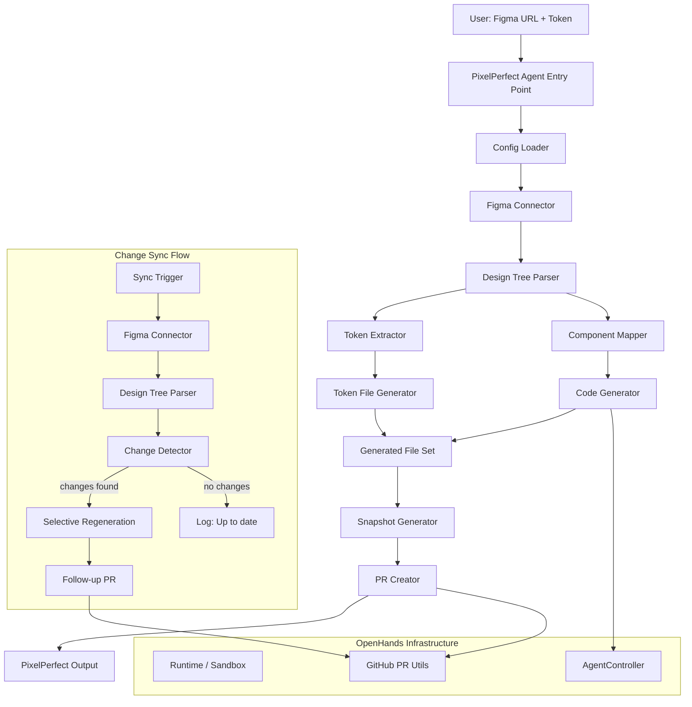

# Design Document: PixelPerfect (Figma-to-Code)

## Overview

PixelPerfect adds a Figma-to-Code agent to the Nunzi platform (built on OpenHands). It follows the same architectural pattern as the existing `openhands/resolver/` module but targets design-to-code translation instead of issue resolution. When triggered, PixelPerfect connects to the Figma API, extracts the design tree and tokens, maps Figma components to React components, generates production-ready TypeScript/React code with Tailwind or CSS Module styling, and creates a pull request. It also supports detecting design changes and opening follow-up sync PRs.

The implementation lives in a new `openhands/pixelperfect/` module. It reuses the existing `Runtime`, `AgentController`, and GitHub PR infrastructure from `openhands/resolver/`.

## Architecture



## Components and Interfaces

### 1. PixelPerfect Agent Entry Point (`openhands/pixelperfect/run.py`)

The CLI entry point, analogous to `openhands/resolver/resolve_issue.py`. Parses arguments, orchestrates the full pipeline, and writes output.

```python
class PixelPerfectAgent:
    def __init__(self, config: PixelPerfectConfig, token: str, repo: str) -> None: ...
    async def run(self, figma_url: str) -> PixelPerfectOutput: ...
    async def sync(self, figma_url: str) -> PixelPerfectOutput: ...
```

**Arguments**: `--repo`, `--figma-url`, `--figma-token`, `--mode` (generate|sync), `--output-dir`, `--llm-model`, `--max-iterations`

### 2. Config Loader (`openhands/pixelperfect/config.py`)

Loads and validates `.pixelperfect.yml` from the repository root. Falls back to defaults when the file is missing.

```python
@dataclass
class FigmaFileMapping:
    url: str
    output_dir: str

@dataclass
class PixelPerfectConfig:
    figma_token: str | None = None
    files: list[FigmaFileMapping] = field(default_factory=list)
    framework: str = "react"
    styling: str = "tailwind"  # "tailwind" | "css-modules"
    typescript: bool = True
    token_format: str = "tailwind"  # "css" | "tailwind" | "typescript"
    component_prefix: str = ""
    ignore_nodes: list[str] = field(default_factory=list)
    snapshots_enabled: bool = True

    @classmethod
    def load(cls, repo_dir: str) -> "PixelPerfectConfig": ...
    def to_dict(self) -> dict: ...
    @classmethod
    def from_dict(cls, data: dict) -> "PixelPerfectConfig": ...
```

### 3. Figma Connector (`openhands/pixelperfect/figma_connector.py`)

Handles Figma API authentication, URL parsing, and data retrieval with retry logic.

```python
@dataclass
class FigmaUrlParts:
    file_key: str
    node_id: str | None = None

class FigmaConnector:
    def __init__(self, token: str) -> None: ...
    def parse_url(self, url: str) -> FigmaUrlParts: ...
    async def get_file(self, file_key: str, node_id: str | None = None) -> dict: ...
    async def _request_with_retry(self, url: str, max_retries: int = 3) -> dict: ...
```

**URL parsing**: Supports formats:
- `https://www.figma.com/file/{file_key}/{file_name}`
- `https://www.figma.com/design/{file_key}/{file_name}`
- `https://www.figma.com/file/{file_key}/{file_name}?node-id={node_id}`

**Retry logic**: Exponential backoff with base delay of 1 second, max 3 retries, on 5xx errors and connection timeouts.

### 4. Design Tree Parser (`openhands/pixelperfect/design_tree.py`)

Parses the raw Figma API JSON response into a structured Design_Tree.

```python
class NodeType(str, Enum):
    FRAME = "FRAME"
    GROUP = "GROUP"
    COMPONENT = "COMPONENT"
    COMPONENT_SET = "COMPONENT_SET"
    INSTANCE = "INSTANCE"
    TEXT = "TEXT"
    RECTANGLE = "RECTANGLE"
    VECTOR = "VECTOR"
    ELLIPSE = "ELLIPSE"
    LINE = "LINE"
    BOOLEAN_OPERATION = "BOOLEAN_OPERATION"

class AutoLayoutProps(BaseModel):
    direction: str  # "HORIZONTAL" | "VERTICAL"
    spacing: float
    padding_top: float
    padding_right: float
    padding_bottom: float
    padding_left: float
    primary_alignment: str  # "MIN" | "CENTER" | "MAX" | "SPACE_BETWEEN"
    counter_alignment: str  # "MIN" | "CENTER" | "MAX"

class StyleProps(BaseModel):
    fills: list[dict]
    strokes: list[dict]
    font_family: str | None = None
    font_size: float | None = None
    font_weight: int | None = None
    line_height: float | None = None
    letter_spacing: float | None = None
    border_radius: float | None = None
    shadows: list[dict] = field(default_factory=list)
    opacity: float = 1.0

class ConstraintProps(BaseModel):
    width_mode: str  # "FIXED" | "FILL" | "HUG"
    height_mode: str  # "FIXED" | "FILL" | "HUG"
    fixed_width: float | None = None
    fixed_height: float | None = None
    min_width: float | None = None
    max_width: float | None = None
    min_height: float | None = None
    max_height: float | None = None

class DesignNode(BaseModel):
    id: str
    name: str
    node_type: NodeType
    children: list["DesignNode"] = []
    auto_layout: AutoLayoutProps | None = None
    style: StyleProps | None = None
    constraints: ConstraintProps | None = None
    component_id: str | None = None  # for INSTANCE nodes
    text_content: str | None = None  # for TEXT nodes
    variant_properties: dict[str, str] | None = None  # for variants

class DesignTree(BaseModel):
    file_key: str
    file_name: str
    nodes: list[DesignNode]
    components: dict[str, DesignNode]  # component_id -> component definition

    def to_json(self) -> str: ...
    @classmethod
    def from_json(cls, json_str: str) -> "DesignTree": ...

class DesignTreeParser:
    def parse(self, file_key: str, raw_response: dict) -> DesignTree: ...
    def _parse_node(self, raw_node: dict) -> DesignNode: ...
    def _resolve_instances(self, tree: DesignTree) -> DesignTree: ...
```

### 5. Token Extractor (`openhands/pixelperfect/token_extractor.py`)

Extracts design tokens from the Design_Tree's styles.

```python
class TokenType(str, Enum):
    COLOR = "color"
    TYPOGRAPHY = "typography"
    SPACING = "spacing"
    SHADOW = "shadow"
    BORDER_RADIUS = "border_radius"

class DesignToken(BaseModel):
    name: str
    token_type: TokenType
    value: dict  # type-specific value structure

class TokenSet(BaseModel):
    tokens: list[DesignToken]

    def to_json(self) -> str: ...
    @classmethod
    def from_json(cls, json_str: str) -> "TokenSet": ...

class TokenExtractor:
    def extract(self, tree: DesignTree) -> TokenSet: ...
    def _extract_colors(self, tree: DesignTree) -> list[DesignToken]: ...
    def _extract_typography(self, tree: DesignTree) -> list[DesignToken]: ...
    def _extract_spacing(self, tree: DesignTree) -> list[DesignToken]: ...
    def _extract_effects(self, tree: DesignTree) -> list[DesignToken]: ...
```

### 6. Token File Generator (`openhands/pixelperfect/token_generator.py`)

Generates design token files in the configured format.

```python
class TokenFileGenerator:
    def generate(self, token_set: TokenSet, format: str) -> str: ...
    def generate_css(self, token_set: TokenSet) -> str: ...
    def generate_tailwind(self, token_set: TokenSet) -> str: ...
    def generate_typescript(self, token_set: TokenSet) -> str: ...
    def parse_css(self, css_str: str) -> TokenSet: ...
    def parse_tailwind(self, tailwind_str: str) -> TokenSet: ...
    def parse_typescript(self, ts_str: str) -> TokenSet: ...
```

### 7. Component Mapper (`openhands/pixelperfect/component_mapper.py`)

Maps Figma design nodes to React component specifications.

```python
class PropSpec(BaseModel):
    name: str
    type: str  # TypeScript type string
    default_value: str | None = None
    description: str | None = None

class CSSProperty(BaseModel):
    property: str
    value: str

class ComponentSpec(BaseModel):
    name: str
    props: list[PropSpec]
    children: list["ComponentSpec"]
    css_properties: list[CSSProperty]
    tailwind_classes: list[str]
    html_tag: str  # "div", "span", "p", "h1", "button", "img", etc.
    text_content: str | None = None
    aria_attributes: dict[str, str] = {}
    source_node_id: str

class ComponentSpecSet(BaseModel):
    components: list[ComponentSpec]

    def to_json(self) -> str: ...
    @classmethod
    def from_json(cls, json_str: str) -> "ComponentSpecSet": ...

class ComponentMapper:
    def __init__(self, config: PixelPerfectConfig) -> None: ...
    def map(self, tree: DesignTree) -> ComponentSpecSet: ...
    def _map_node(self, node: DesignNode) -> ComponentSpec: ...
    def _map_auto_layout_to_css(self, layout: AutoLayoutProps) -> list[CSSProperty]: ...
    def _map_style_to_css(self, style: StyleProps) -> list[CSSProperty]: ...
    def _map_constraints_to_css(self, constraints: ConstraintProps) -> list[CSSProperty]: ...
    def _map_variants_to_props(self, component_set: DesignNode) -> list[PropSpec]: ...
    def _infer_html_tag(self, node: DesignNode) -> str: ...
```

**Auto-layout to CSS mapping**:
| Figma Property | CSS Property |
|---|---|
| direction: HORIZONTAL | flex-direction: row |
| direction: VERTICAL | flex-direction: column |
| spacing | gap |
| padding_* | padding-* |
| primaryAlignment: MIN | justify-content: flex-start |
| primaryAlignment: CENTER | justify-content: center |
| primaryAlignment: MAX | justify-content: flex-end |
| primaryAlignment: SPACE_BETWEEN | justify-content: space-between |
| counterAlignment: MIN | align-items: flex-start |
| counterAlignment: CENTER | align-items: center |
| counterAlignment: MAX | align-items: flex-end |

**Constraint to CSS mapping**:
| Figma Constraint | CSS Property |
|---|---|
| FIXED width | width: {value}px |
| FILL width | width: 100% |
| HUG width | width: fit-content |
| min/max dimensions | min-width, max-width, etc. |

### 8. Code Generator (`openhands/pixelperfect/code_generator.py`)

Transforms Component_Spec objects into React/TypeScript code using the OpenHands agent controller.

```python
class GeneratedFile(BaseModel):
    path: str
    content: str
    file_type: str  # "component" | "css_module" | "token" | "barrel" | "story" | "test"

class GeneratedFileSet(BaseModel):
    files: list[GeneratedFile]

    def to_json(self) -> str: ...
    @classmethod
    def from_json(cls, json_str: str) -> "GeneratedFileSet": ...

class CodeGenerator:
    def __init__(self, config: PixelPerfectConfig, llm_config: LLMConfig) -> None: ...
    async def generate(
        self, spec_set: ComponentSpecSet, token_set: TokenSet
    ) -> GeneratedFileSet: ...
    def generate_barrel_export(self, components: list[ComponentSpec]) -> GeneratedFile: ...
    def generate_token_file(self, token_set: TokenSet) -> GeneratedFile: ...
```

**Generation strategy**: The agent receives a structured prompt containing:
1. The Component_Spec (name, props, children, CSS, HTML tag)
2. The Token_Set (available design tokens)
3. The styling configuration (Tailwind or CSS Modules)
4. Instructions to produce a complete React/TypeScript component

### 9. Change Detector (`openhands/pixelperfect/change_detector.py`)

Compares two Design_Tree versions to identify changes.

```python
class ChangeType(str, Enum):
    ADDED = "added"
    REMOVED = "removed"
    MODIFIED = "modified"

class NodeChange(BaseModel):
    node_id: str
    node_name: str
    change_type: ChangeType
    modified_properties: list[str] | None = None  # for MODIFIED changes

class ChangeSet(BaseModel):
    changes: list[NodeChange]

    def to_json(self) -> str: ...
    @classmethod
    def from_json(cls, json_str: str) -> "ChangeSet": ...

    @property
    def has_changes(self) -> bool:
        return len(self.changes) > 0

class ChangeDetector:
    def compare(self, old_tree: DesignTree, new_tree: DesignTree) -> ChangeSet: ...
    def _diff_nodes(
        self, old_nodes: dict[str, DesignNode], new_nodes: dict[str, DesignNode]
    ) -> list[NodeChange]: ...
    def _diff_properties(self, old_node: DesignNode, new_node: DesignNode) -> list[str]: ...
```

**Comparison strategy**: Build a flat map of `node_id -> DesignNode` for both trees. Nodes present only in the new tree are ADDED, only in the old tree are REMOVED, and present in both but with different properties are MODIFIED.

### 10. Snapshot Generator (`openhands/pixelperfect/snapshot_generator.py`)

Produces Storybook story files for visual regression testing.

```python
class SnapshotGenerator:
    def __init__(self, config: PixelPerfectConfig) -> None: ...
    def generate_stories(self, spec_set: ComponentSpecSet) -> list[GeneratedFile]: ...
    def _generate_story(self, spec: ComponentSpec) -> GeneratedFile: ...
    def _generate_variant_stories(self, spec: ComponentSpec) -> str: ...
```

### 11. PR Creator (`openhands/pixelperfect/pr_creator.py`)

Creates pull requests using the existing OpenHands GitHub infrastructure.

```python
class PRCreator:
    def __init__(self, token: str, repo: str) -> None: ...
    async def create_pr(
        self,
        file_set: GeneratedFileSet,
        figma_file_name: str,
        figma_url: str,
        output_dir: str,
    ) -> str: ...
    async def create_sync_pr(
        self,
        file_set: GeneratedFileSet,
        change_set: ChangeSet,
        figma_file_name: str,
        figma_url: str,
        output_dir: str,
    ) -> str: ...
    def generate_branch_name(self, file_key: str) -> str: ...
    def generate_pr_title(self, file_name: str, component_count: int) -> str: ...
    def generate_pr_body(
        self,
        components: list[str],
        token_count: int,
        figma_url: str,
        change_set: ChangeSet | None = None,
    ) -> str: ...
```

## Data Models

```python
from enum import Enum
from pydantic import BaseModel
from dataclasses import dataclass, field

# --- Enums ---
class NodeType(str, Enum):
    FRAME = "FRAME"
    GROUP = "GROUP"
    COMPONENT = "COMPONENT"
    COMPONENT_SET = "COMPONENT_SET"
    INSTANCE = "INSTANCE"
    TEXT = "TEXT"
    RECTANGLE = "RECTANGLE"
    VECTOR = "VECTOR"
    ELLIPSE = "ELLIPSE"
    LINE = "LINE"
    BOOLEAN_OPERATION = "BOOLEAN_OPERATION"

class TokenType(str, Enum):
    COLOR = "color"
    TYPOGRAPHY = "typography"
    SPACING = "spacing"
    SHADOW = "shadow"
    BORDER_RADIUS = "border_radius"

class ChangeType(str, Enum):
    ADDED = "added"
    REMOVED = "removed"
    MODIFIED = "modified"

# --- Design Tree ---
class AutoLayoutProps(BaseModel):
    direction: str
    spacing: float
    padding_top: float
    padding_right: float
    padding_bottom: float
    padding_left: float
    primary_alignment: str
    counter_alignment: str

class StyleProps(BaseModel):
    fills: list[dict]
    strokes: list[dict]
    font_family: str | None = None
    font_size: float | None = None
    font_weight: int | None = None
    line_height: float | None = None
    letter_spacing: float | None = None
    border_radius: float | None = None
    shadows: list[dict] = []
    opacity: float = 1.0

class ConstraintProps(BaseModel):
    width_mode: str
    height_mode: str
    fixed_width: float | None = None
    fixed_height: float | None = None
    min_width: float | None = None
    max_width: float | None = None
    min_height: float | None = None
    max_height: float | None = None

class DesignNode(BaseModel):
    id: str
    name: str
    node_type: NodeType
    children: list["DesignNode"] = []
    auto_layout: AutoLayoutProps | None = None
    style: StyleProps | None = None
    constraints: ConstraintProps | None = None
    component_id: str | None = None
    text_content: str | None = None
    variant_properties: dict[str, str] | None = None

class DesignTree(BaseModel):
    file_key: str
    file_name: str
    nodes: list[DesignNode]
    components: dict[str, DesignNode]

# --- Tokens ---
class DesignToken(BaseModel):
    name: str
    token_type: TokenType
    value: dict

class TokenSet(BaseModel):
    tokens: list[DesignToken]

# --- Component Specs ---
class PropSpec(BaseModel):
    name: str
    type: str
    default_value: str | None = None
    description: str | None = None

class CSSProperty(BaseModel):
    property: str
    value: str

class ComponentSpec(BaseModel):
    name: str
    props: list[PropSpec]
    children: list["ComponentSpec"]
    css_properties: list[CSSProperty]
    tailwind_classes: list[str]
    html_tag: str
    text_content: str | None = None
    aria_attributes: dict[str, str] = {}
    source_node_id: str

class ComponentSpecSet(BaseModel):
    components: list[ComponentSpec]

# --- Generated Files ---
class GeneratedFile(BaseModel):
    path: str
    content: str
    file_type: str

class GeneratedFileSet(BaseModel):
    files: list[GeneratedFile]

# --- Change Detection ---
class NodeChange(BaseModel):
    node_id: str
    node_name: str
    change_type: ChangeType
    modified_properties: list[str] | None = None

class ChangeSet(BaseModel):
    changes: list[NodeChange]

# --- Output ---
class PixelPerfectOutput(BaseModel):
    figma_file_key: str
    figma_file_name: str
    components_generated: int
    tokens_extracted: int
    files_created: int
    pr_url: str | None = None
    changes_detected: int | None = None
    errors: list[str]
```


## Correctness Properties

*A property is a characteristic or behavior that should hold true across all valid executions of a system — essentially, a formal statement about what the system should do. Properties serve as the bridge between human-readable specifications and machine-verifiable correctness guarantees.*

### Property 1: Design_Tree round-trip serialization

*For any* valid `DesignTree` object, serializing it to JSON and then deserializing the JSON back should produce an equivalent `DesignTree` object.

**Validates: Requirements 2.5, 2.6**

### Property 2: Token_Set round-trip serialization

*For any* valid `TokenSet` object, serializing it to JSON and then deserializing the JSON back should produce an equivalent `TokenSet` object.

**Validates: Requirements 3.5, 3.6**

### Property 3: Token file round-trip

*For any* valid `TokenSet` object and any supported format (CSS, Tailwind, TypeScript), generating a token file then parsing it back should produce an equivalent `TokenSet` object.

**Validates: Requirements 3.7, 3.8, 3.9**

### Property 4: Component_Spec_Set round-trip serialization

*For any* valid `ComponentSpecSet` object, serializing it to JSON and then deserializing the JSON back should produce an equivalent `ComponentSpecSet` object.

**Validates: Requirements 4.7, 4.8**

### Property 5: Generated_File_Set round-trip serialization

*For any* valid `GeneratedFileSet` object, serializing it to JSON and then deserializing the JSON back should produce an equivalent `GeneratedFileSet` object.

**Validates: Requirements 5.9, 5.10**

### Property 6: Change_Set round-trip serialization

*For any* valid `ChangeSet` object, serializing it to JSON and then deserializing the JSON back should produce an equivalent `ChangeSet` object.

**Validates: Requirements 7.3, 7.4**

### Property 7: PixelPerfect_Output round-trip serialization

*For any* valid `PixelPerfectOutput` object, serializing it to JSON and then deserializing the JSON back should produce an equivalent `PixelPerfectOutput` object.

**Validates: Requirements 10.4**

### Property 8: Figma URL parsing extracts correct parts

*For any* valid Figma file URL (with or without a node ID), parsing the URL should extract the correct file key and, when present, the correct node ID.

**Validates: Requirements 1.1**

### Property 9: Design_Tree parsing preserves all node properties

*For any* valid Figma API response containing nodes with auto-layout, style, and constraint properties, the parsed `DesignTree` should contain `DesignNode` objects with all corresponding properties preserved (auto-layout direction/spacing/padding/alignment, style fills/strokes/typography/shadows/opacity, constraint sizing modes and dimensions).

**Validates: Requirements 2.1, 2.2, 2.3, 2.4**

### Property 10: Component instance references are resolved

*For any* `DesignTree` containing INSTANCE nodes that reference main components, after resolution every INSTANCE node's `component_id` should map to an existing entry in the tree's `components` dictionary.

**Validates: Requirements 2.7**

### Property 11: Token extraction covers all style types

*For any* Figma file data containing color styles, text styles, spacing values, and effect styles, the extracted `TokenSet` should contain at least one token of each corresponding type (COLOR, TYPOGRAPHY, SPACING, SHADOW).

**Validates: Requirements 3.1, 3.2, 3.3, 3.4**

### Property 12: Component mapping produces correct hierarchy and props

*For any* `DesignTree` containing Figma components and component sets, the `ComponentMapper` should produce a `ComponentSpecSet` where: (a) each Figma component maps to a distinct `ComponentSpec`, (b) component set variants map to `PropSpec` entries, and (c) nested components produce correct parent-child `ComponentSpec` hierarchies.

**Validates: Requirements 4.1, 4.2, 4.3**

### Property 13: Auto-layout maps to correct CSS flexbox properties

*For any* `DesignNode` with `AutoLayoutProps`, the `ComponentMapper` should produce `CSSProperty` entries where: direction maps to flex-direction, spacing maps to gap, padding values map to padding-*, and alignment values map to justify-content/align-items.

**Validates: Requirements 4.4**

### Property 14: Text nodes map to CSS typography properties

*For any* `DesignNode` of type TEXT with style properties, the `ComponentMapper` should produce a `ComponentSpec` containing the text content and CSS properties for font-family, font-size, font-weight, line-height, and letter-spacing.

**Validates: Requirements 4.5**

### Property 15: Constraint nodes map to CSS sizing properties

*For any* `DesignNode` with `ConstraintProps`, the `ComponentMapper` should produce CSS properties where FIXED maps to explicit width/height, FILL maps to 100%, and HUG maps to fit-content, with min/max dimensions preserved.

**Validates: Requirements 4.6**

### Property 16: Generated code contains required structure

*For any* `ComponentSpec`, the generated React/TypeScript code should contain: an import statement, a props interface (if props exist), and a JSX return statement with the correct HTML tag.

**Validates: Requirements 5.1**

### Property 17: Tailwind styling generates utility classes

*For any* `ComponentSpec` with CSS properties and Tailwind configuration, the generated code should contain Tailwind utility class strings corresponding to the CSS properties.

**Validates: Requirements 5.2**

### Property 18: CSS Modules generates companion file

*For any* `ComponentSpec` with CSS Modules configuration, the `GeneratedFileSet` should contain both a `.tsx` component file and a corresponding `.module.css` file with scoped class names.

**Validates: Requirements 5.3**

### Property 19: Barrel export contains all components

*For any* set of generated components, the barrel export file (`index.ts`) should contain an export statement for each component name.

**Validates: Requirements 5.6**

### Property 20: Change detection correctly categorizes differences

*For any* two `DesignTree` objects, the `ChangeDetector` should produce a `ChangeSet` where: nodes present only in the new tree are ADDED, nodes present only in the old tree are REMOVED, and nodes present in both with different properties are MODIFIED with the correct list of modified property names.

**Validates: Requirements 7.1, 7.2**

### Property 21: Identical trees produce empty Change_Set

*For any* `DesignTree`, comparing it against itself should produce a `ChangeSet` with zero changes.

**Validates: Requirements 7.7**

### Property 22: PR content contains required information

*For any* generation result (file name, component list, token count, Figma URL), the generated PR title should contain the file name and component count, and the PR body should contain the component list, token count, and Figma URL.

**Validates: Requirements 6.3, 6.4**

### Property 23: Sync PR body describes changes

*For any* `ChangeSet` with changes, the generated follow-up PR body should contain a description of the added, removed, and modified nodes.

**Validates: Requirements 7.6**

### Property 24: Story files cover all components and variants

*For any* `ComponentSpecSet`, the `SnapshotGenerator` should produce one story file per component, and each story file should contain a story for each variant (prop combination) of that component.

**Validates: Requirements 9.1, 9.2**

### Property 25: Config parsing with defaults

*For any* valid `.pixelperfect.yml` YAML string, `PixelPerfectConfig.load()` should parse all supported fields. For missing fields, the config should use default values (`framework="react"`, `styling="tailwind"`, `typescript=True`, `token_format="tailwind"`, `component_prefix=""`, `snapshots_enabled=True`).

**Validates: Requirements 8.1, 8.2, 8.3, 8.4, 8.5, 8.6, 8.7, 8.8, 8.9, 8.10**

## Error Handling

| Scenario | Component | Behavior |
|---|---|---|
| Figma API authentication error | FigmaConnector | Return descriptive error message |
| Figma API server error / unreachable | FigmaConnector | Retry up to 3 times with exponential backoff, then return error |
| No `.pixelperfect.yml` found | ConfigLoader | Use default config, continue |
| Invalid `.pixelperfect.yml` | ConfigLoader | Log warning, use default config, continue |
| Invalid Figma URL format | FigmaConnector | Return descriptive parsing error |
| Component generation fails for one component | CodeGenerator | Log error, continue with remaining components |
| Branch/PR creation fails | PRCreator | Log error with context, report in PixelPerfectOutput |
| No changes detected during sync | ChangeDetector | Log "up to date", no PR created |
| Snapshots disabled in config | SnapshotGenerator | Skip snapshot creation entirely |
| Agent exceeds max iterations | CodeGenerator | Return partial results collected so far |

## Testing Strategy

### Property-Based Testing

Use `hypothesis` (Python) for property-based testing. Each property test should run a minimum of 100 iterations.

Each property-based test must be tagged with a comment:
```python
# Feature: pixelperfect-figma, Property N: <property_text>
```

Property tests cover:
- Round-trip serialization for all data models (Properties 1–7)
- Figma URL parsing (Property 8)
- Design tree parsing completeness (Property 9)
- Component instance resolution (Property 10)
- Token extraction coverage (Property 11)
- Component mapping hierarchy and props (Property 12)
- Auto-layout to CSS mapping (Property 13)
- Text node to CSS mapping (Property 14)
- Constraint to CSS mapping (Property 15)
- Generated code structure (Property 16)
- Tailwind class generation (Property 17)
- CSS Modules file generation (Property 18)
- Barrel export completeness (Property 19)
- Change detection correctness (Property 20)
- Identical tree comparison (Property 21)
- PR content completeness (Property 22)
- Sync PR body content (Property 23)
- Story file coverage (Property 24)
- Config parsing with defaults (Property 25)

### Unit Testing

Use `pytest` for unit tests. Unit tests complement property tests by covering:
- Figma API authentication (mocked API calls)
- Retry logic with exponential backoff
- Specific Figma URL formats (edge cases)
- Config loading edge cases (missing file, invalid YAML, partial config)
- Error handling paths (API failures, generation failures, PR creation failures)
- Specific component generation examples (button, card, form layout)
- Token file generation in each format (CSS, Tailwind, TypeScript)

### Test Organization

```
tests/unit/test_pixelperfect/
├── test_models.py              # Property tests for round-trip serialization (P1–P7)
├── test_config.py              # Property test for config parsing (P25) + unit tests
├── test_figma_connector.py     # Property test for URL parsing (P8) + unit tests
├── test_design_tree.py         # Property tests for parsing/resolution (P9, P10) + unit tests
├── test_token_extractor.py     # Property test for token extraction (P11) + unit tests
├── test_token_generator.py     # Property test for token file round-trip (P3)
├── test_component_mapper.py    # Property tests for mapping (P12, P13, P14, P15) + unit tests
├── test_code_generator.py      # Property tests for code gen (P16, P17, P18, P19) + unit tests
├── test_change_detector.py     # Property tests for change detection (P20, P21)
├── test_pr_creator.py          # Property tests for PR content (P22, P23) + unit tests
├── test_snapshot_generator.py  # Property test for story coverage (P24) + unit tests
└── test_run.py                 # Unit tests for orchestration and error handling
```
