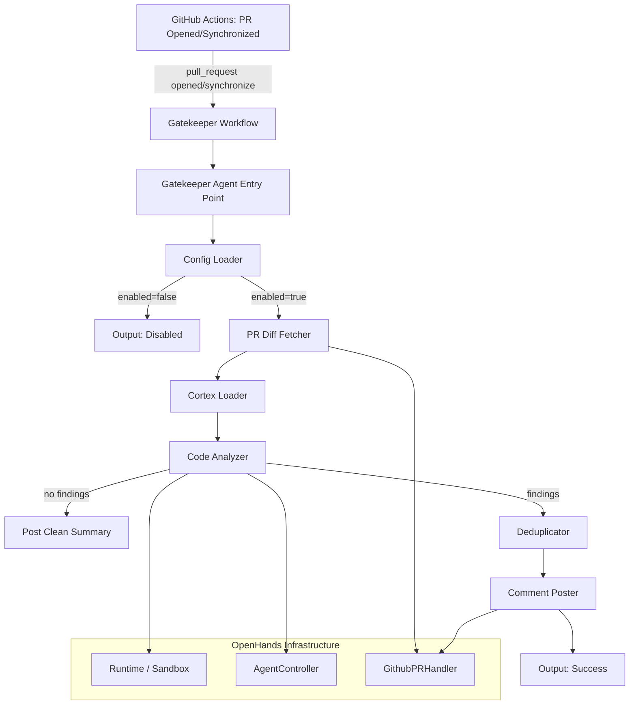

# Design Document: Gatekeeper (Semantic Code Review)

## Overview

Gatekeeper adds an AI-powered semantic code review agent to the Nunzi platform (built on OpenHands). It follows the same architectural pattern as the existing `openhands/resolver/` module but targets PR code review instead of issue resolution. When a pull request is opened or updated, Gatekeeper fetches the diff, loads team-specific coding standards from a Cortex knowledge base (or repository config), analyzes the changed code for style violations, security vulnerabilities, and complexity issues, deduplicates and filters findings, and posts inline review comments on the PR.

The implementation lives in a new `openhands/gatekeeper/` module and a companion GitHub Actions workflow. It reuses the existing `Runtime`, `AgentController`, `GithubPRHandler`, and GitHub API infrastructure from `openhands/resolver/`.

## Architecture



## Components and Interfaces

### 1. Gatekeeper Workflow (`gatekeeper-review.yml`)

A GitHub Actions workflow triggered by `pull_request` events with `types: [opened, synchronize]`. It installs OpenHands, invokes the Gatekeeper entry point, and uploads the output artifact.

**Inputs**: `max_iterations`, `LLM_MODEL`
**Secrets**: `LLM_API_KEY`, `PAT_TOKEN`

### 2. Gatekeeper Agent Entry Point (`openhands/gatekeeper/review_pr.py`)

The CLI entry point, analogous to `openhands/resolver/resolve_issue.py`. Parses arguments, orchestrates the full review pipeline, and writes output.

```python
class GatekeeperAgent:
    def __init__(self, config: GatekeeperConfig, token: str, repo: str) -> None: ...
    async def run(self, pr_number: int) -> GatekeeperOutput: ...
```

**Arguments**: `--repo`, `--pr-number`, `--token`, `--max-iterations`, `--llm-model`, `--output-dir`

### 3. Config Loader (`openhands/gatekeeper/config.py`)

Loads and validates `.gatekeeper.yml` from the repository root. Falls back to defaults when the file is missing or invalid.

```python
class Severity(str, Enum):
    INFO = "info"
    WARNING = "warning"
    ERROR = "error"

@dataclass
class GatekeeperConfig:
    enabled: bool = True
    cortex_id: str | None = None
    categories: list[str] = field(default_factory=lambda: ["style", "security", "complexity"])
    min_severity: Severity = Severity.INFO
    ignore_paths: list[str] = field(default_factory=list)
    custom_rules: list[dict] = field(default_factory=list)
    max_comments: int = 50

    @classmethod
    def load(cls, repo_dir: str) -> "GatekeeperConfig": ...
    def to_dict(self) -> dict: ...
    @classmethod
    def from_dict(cls, data: dict) -> "GatekeeperConfig": ...
```

### 4. Cortex Loader (`openhands/gatekeeper/cortex_loader.py`)

Loads team-specific coding standards from a Cortex knowledge base. Falls back to built-in defaults if Cortex is unavailable.

```python
class RuleCategory(str, Enum):
    STYLE = "style"
    SECURITY = "security"
    COMPLEXITY = "complexity"

class Rule(BaseModel):
    id: str
    category: RuleCategory
    severity: Severity
    description: str
    pattern: str  # regex or heuristic description
    suggestion_template: str

class RuleSet(BaseModel):
    rules: list[Rule]
    source: str  # "cortex", "config", "default"

    def to_json(self) -> str: ...
    @classmethod
    def from_json(cls, json_str: str) -> "RuleSet": ...

class CortexLoader:
    def __init__(self, config: GatekeeperConfig) -> None: ...
    async def load_rules(self) -> RuleSet: ...
    def merge_custom_rules(self, base: RuleSet, custom_rules: list[dict]) -> RuleSet: ...
    def get_default_rules(self) -> RuleSet: ...
```

**Built-in default rules** include:
- Style: `print()` usage instead of `logger`, inconsistent naming conventions, missing type hints
- Security: SQL string concatenation, hardcoded secrets patterns, `eval()`/`exec()` usage, `subprocess.call(shell=True)`
- Complexity: Functions exceeding 50 lines, nesting depth > 4, excessive parameters (> 7)

### 5. PR Diff Fetcher (`openhands/gatekeeper/diff_fetcher.py`)

Retrieves the PR diff and changed file contents using the existing `GithubPRHandler` from `openhands/resolver/interfaces/github.py`.

```python
@dataclass
class ChangedFile:
    path: str
    patch: str  # unified diff for this file
    content: str  # full file content after changes
    language: str  # detected programming language

class PRDiffFetcher:
    def __init__(self, token: str, repo: str) -> None: ...
    async def fetch(self, pr_number: int) -> list[ChangedFile]: ...
    def detect_language(self, file_path: str) -> str: ...
```

### 6. Code Analyzer (`openhands/gatekeeper/code_analyzer.py`)

Uses the OpenHands agent controller to analyze changed code against the loaded Rule_Set. Produces structured findings.

```python
class Finding(BaseModel):
    file_path: str
    line_number: int
    rule_id: str
    category: RuleCategory
    severity: Severity
    explanation: str
    suggested_fix: str

class FindingSet(BaseModel):
    pr_number: int
    findings: list[Finding]

    def to_json(self) -> str: ...
    @classmethod
    def from_json(cls, json_str: str) -> "FindingSet": ...

class CodeAnalyzer:
    def __init__(self, config: GatekeeperConfig, llm_config: LLMConfig) -> None: ...
    async def analyze(
        self, changed_files: list[ChangedFile], rule_set: RuleSet
    ) -> FindingSet: ...
```

**Analysis strategy**: The agent receives a structured prompt containing:
1. The Rule_Set (all active rules with patterns and descriptions)
2. The changed file content and its diff
3. Instructions to produce structured JSON findings
4. Category-specific guidance (style patterns to look for, security vulnerability patterns, complexity thresholds)

### 7. Deduplicator (`openhands/gatekeeper/deduplicator.py`)

Removes duplicate, irrelevant, and low-severity findings.

```python
class Deduplicator:
    def __init__(self, config: GatekeeperConfig, changed_lines: dict[str, set[int]]) -> None: ...
    def deduplicate(self, finding_set: FindingSet) -> FindingSet: ...
    def _remove_duplicates(self, findings: list[Finding]) -> list[Finding]: ...
    def _filter_unchanged_lines(self, findings: list[Finding]) -> list[Finding]: ...
    def _filter_severity(self, findings: list[Finding]) -> list[Finding]: ...
    def _filter_ignored_paths(self, findings: list[Finding]) -> list[Finding]: ...
```

**Deduplication key**: `(file_path, line_number, rule_id)` — if multiple findings share this key, keep only the first.

**Changed lines extraction**: Parse the unified diff to determine which line numbers in each file were actually added or modified. Only findings on those lines are kept.

### 8. Comment Poster (`openhands/gatekeeper/comment_poster.py`)

Posts inline review comments and a summary on the PR using the GitHub review API.

```python
@dataclass
class ReviewComment:
    path: str
    line: int
    body: str

class ReviewSummary(BaseModel):
    total_findings: int
    by_category: dict[str, int]
    by_severity: dict[str, int]
    truncated: bool
    truncated_count: int

class CommentPoster:
    def __init__(self, token: str, repo: str, max_comments: int) -> None: ...
    async def post_review(
        self, pr_number: int, finding_set: FindingSet
    ) -> ReviewSummary: ...
    def format_comment(self, finding: Finding) -> str: ...
    def format_summary(self, finding_set: FindingSet, truncated: bool, truncated_count: int) -> str: ...
    def prioritize_findings(self, findings: list[Finding], max_count: int) -> list[Finding]: ...
```

**Comment format**:
```
🔍 **[{category}]** {severity}

{explanation}

💡 **Suggestion:** {suggested_fix}

_Rule: {rule_id}_
```

**Truncation**: When findings exceed `max_comments`, sort by severity (error > warning > info), take the top N, and note in the summary how many were omitted.

## Data Models

```python
from enum import Enum
from pydantic import BaseModel
from dataclasses import dataclass, field

class Severity(str, Enum):
    INFO = "info"
    WARNING = "warning"
    ERROR = "error"

class RuleCategory(str, Enum):
    STYLE = "style"
    SECURITY = "security"
    COMPLEXITY = "complexity"

class Rule(BaseModel):
    id: str
    category: RuleCategory
    severity: Severity
    description: str
    pattern: str
    suggestion_template: str

class RuleSet(BaseModel):
    rules: list[Rule]
    source: str

class ChangedFile(BaseModel):
    path: str
    patch: str
    content: str
    language: str

class Finding(BaseModel):
    file_path: str
    line_number: int
    rule_id: str
    category: RuleCategory
    severity: Severity
    explanation: str
    suggested_fix: str

class FindingSet(BaseModel):
    pr_number: int
    findings: list[Finding]

class ReviewSummary(BaseModel):
    total_findings: int
    by_category: dict[str, int]
    by_severity: dict[str, int]
    truncated: bool
    truncated_count: int

class GatekeeperOutput(BaseModel):
    pr_number: int
    files_analyzed: int
    findings_produced: int
    findings_after_filter: int
    comments_posted: int
    review_summary: ReviewSummary | None
    errors: list[str]
```

## Correctness Properties

*A property is a characteristic or behavior that should hold true across all valid executions of a system — essentially, a formal statement about what the system should do. Properties serve as the bridge between human-readable specifications and machine-verifiable correctness guarantees.*

### Property 1: Rule_Set round-trip serialization

*For any* valid `RuleSet` object, serializing it to JSON and then deserializing the JSON back should produce an equivalent `RuleSet` object.

**Validates: Requirements 2.5, 2.6**

### Property 2: Finding_Set round-trip serialization

*For any* valid `FindingSet` object, serializing it to JSON and then deserializing the JSON back should produce an equivalent `FindingSet` object.

**Validates: Requirements 3.6, 3.7**

### Property 3: Gatekeeper_Output round-trip serialization

*For any* valid `GatekeeperOutput` object, serializing it to JSON and then deserializing the JSON back should produce an equivalent `GatekeeperOutput` object.

**Validates: Requirements 7.4**

### Property 4: Custom rules take precedence on merge

*For any* base `RuleSet` and any list of custom rules where a custom rule has the same `id` as a base rule, the merged `RuleSet` should contain the custom rule's definition (not the base rule's) for that `id`.

**Validates: Requirements 2.3**

### Property 5: All rules have valid categories

*For any* `RuleSet` loaded by the `CortexLoader`, every `Rule` in the set should have a `category` value that is one of `style`, `security`, or `complexity`.

**Validates: Requirements 2.4**

### Property 6: Findings contain all required fields

*For any* `Finding` produced by the `CodeAnalyzer`, the `file_path`, `line_number`, `rule_id`, `severity`, `explanation`, and `suggested_fix` fields should all be non-empty.

**Validates: Requirements 3.5**

### Property 7: Deduplication removes exact duplicates

*For any* `FindingSet` containing findings where two or more share the same `(file_path, line_number, rule_id)` tuple, the deduplicated result should contain exactly one finding per unique tuple.

**Validates: Requirements 4.1**

### Property 8: Filtering respects all criteria

*For any* `FindingSet`, set of changed lines, severity threshold, and ignore path patterns, every finding in the filtered result should: (a) be on a line present in the changed lines set, (b) have severity >= the threshold, and (c) not match any ignore path pattern.

**Validates: Requirements 4.2, 4.3, 4.4**

### Property 9: Comment formatting includes all required information

*For any* `Finding`, the formatted comment string should contain the rule category, severity level, explanation text, and suggested fix text.

**Validates: Requirements 5.1, 5.2**

### Property 10: Review_Summary has correct counts

*For any* `FindingSet`, the `ReviewSummary` should have `total_findings` equal to the length of the findings list, and the sum of `by_category` values and the sum of `by_severity` values should each equal `total_findings`.

**Validates: Requirements 5.3**

### Property 11: Truncation respects max_comments with severity ordering

*For any* `FindingSet` with more findings than `max_comments`, the posted findings should be exactly `max_comments` in count, should be ordered by severity descending (error first, then warning, then info), and the `ReviewSummary` should indicate truncation with the correct omitted count.

**Validates: Requirements 6.9**

### Property 12: Config parsing with defaults

*For any* valid `.gatekeeper.yml` YAML string, `GatekeeperConfig.load()` should parse all supported fields (`enabled`, `cortex_id`, `categories`, `min_severity`, `ignore_paths`, `custom_rules`, `max_comments`). For missing fields, the config should use default values (`enabled=True`, `categories=["style","security","complexity"]`, `min_severity="info"`, `max_comments=50`).

**Validates: Requirements 6.1, 6.3, 6.4, 6.5, 6.6, 6.7, 6.8**

## Error Handling

| Scenario | Component | Behavior |
|---|---|---|
| GitHub API unreachable | GatekeeperAgent | Log error, terminate gracefully, write GatekeeperOutput with error |
| No `.gatekeeper.yml` found | ConfigLoader | Use default config, continue |
| Invalid `.gatekeeper.yml` | ConfigLoader | Log warning, use default config, continue |
| Cortex knowledge base unavailable | CortexLoader | Fall back to built-in default rules, log warning |
| Unsupported file language | CodeAnalyzer | Skip file, log notice, continue with remaining files |
| Agent exceeds max iterations | CodeAnalyzer | Return partial findings collected so far |
| No findings produced | GatekeeperAgent | Post clean Review_Summary, write output |
| Comment posting fails | CommentPoster | Log error, continue with remaining comments |
| Findings exceed max_comments | CommentPoster | Truncate to highest-severity, note in summary |

## Testing Strategy

### Property-Based Testing

Use `hypothesis` (Python) for property-based testing. Each property test should run a minimum of 100 iterations.

Each property-based test must be tagged with a comment:
```python
# Feature: semantic-code-review, Property N: <property_text>
```

Property tests cover:
- Round-trip serialization for all data models (Properties 1, 2, 3)
- Rule merging precedence (Property 4)
- Rule category validation (Property 5)
- Finding field completeness (Property 6)
- Deduplication correctness (Property 7)
- Filtering correctness (Property 8)
- Comment formatting completeness (Property 9)
- Summary count accuracy (Property 10)
- Truncation behavior (Property 11)
- Config parsing with defaults (Property 12)

### Unit Testing

Use `pytest` for unit tests. Unit tests complement property tests by covering:
- Specific code analysis examples (print() detection, SQL injection patterns, long functions)
- Config loading edge cases (missing file, invalid YAML, partial config, disabled)
- Error handling paths (API failures, Cortex unavailable, unsupported language)
- Comment formatting with specific examples
- Review summary formatting for empty findings
- Diff parsing for changed line extraction

### Test Organization

```
tests/unit/test_gatekeeper/
├── test_models.py          # Property tests for round-trip serialization (P1, P2, P3)
├── test_config.py          # Property test for config parsing (P12) + unit tests
├── test_cortex_loader.py   # Property tests for rule merging/categories (P4, P5) + unit tests
├── test_code_analyzer.py   # Property test for finding completeness (P6) + unit tests
├── test_deduplicator.py    # Property tests for dedup/filtering (P7, P8)
├── test_comment_poster.py  # Property tests for formatting/summary/truncation (P9, P10, P11)
└── test_review_pr.py       # Unit tests for orchestration and error handling
```
