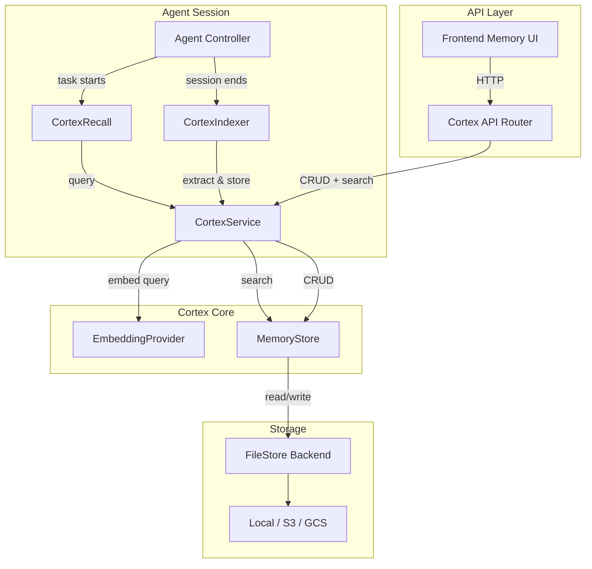

# Design Document: Project Cortex (Semantic Memory & Learning)

## Overview

Cortex adds a persistent semantic memory layer to OpenHands. It sits alongside the existing `openhands/memory/` module (which handles in-session conversation memory and condensation) and provides cross-session knowledge persistence via vector embeddings.

The system follows the existing OpenHands storage patterns: an abstract store interface with pluggable backends (local file, S3, etc.), Pydantic data models, and configuration via the `OpenHandsConfig` system. The embedding generation is delegated to the same LLM infrastructure already in the codebase (via `litellm`), keeping external dependencies minimal.

Key design decisions:
- **Local-first vector search**: Use a lightweight in-process vector index (numpy cosine similarity) rather than requiring an external vector database. This keeps deployment simple and aligns with OpenHands' local-first philosophy.
- **LLM-based indexing**: Use the existing LLM infrastructure to extract knowledge from completed sessions, avoiding new NLP dependencies.
- **Lazy embedding**: If the embedding provider is unavailable, entries are stored without embeddings and backfilled later.

## Architecture



The architecture integrates at three points:
1. **Session start**: `CortexRecall` queries relevant memories and injects them into the agent prompt via the existing `Memory` class event system.
2. **Session end**: `CortexIndexer` extracts knowledge from the completed session and stores it.
3. **User management**: The Cortex API exposes CRUD and search endpoints for the frontend.

## Components and Interfaces

### 1. MemoryEntry (Data Model)

The core data unit. Stored as JSON files in the FileStore.

```python
from pydantic import BaseModel, Field
from datetime import datetime
from enum import Enum
import uuid

class KnowledgeCategory(str, Enum):
    STYLE_PREFERENCE = "style_preference"
    ARCHITECTURAL_DECISION = "architectural_decision"
    BUG_FIX = "bug_fix"
    CODE_PATTERN = "code_pattern"
    PROJECT_CONTEXT = "project_context"
    WORKFLOW = "workflow"

class MemoryEntry(BaseModel):
    id: str = Field(default_factory=lambda: str(uuid.uuid4()))
    content: str
    category: KnowledgeCategory
    metadata: dict[str, str] = Field(default_factory=dict)
    embedding: list[float] | None = None
    created_at: datetime = Field(default_factory=datetime.utcnow)
    updated_at: datetime = Field(default_factory=datetime.utcnow)
    source_conversation_id: str | None = None
```

### 2. EmbeddingProvider (Interface + Implementation)

Wraps embedding generation. Uses `litellm.embedding()` under the hood.

```python
from abc import ABC, abstractmethod

class EmbeddingProvider(ABC):
    @abstractmethod
    async def embed(self, text: str) -> list[float]:
        """Generate an embedding vector for the given text."""

    @abstractmethod
    async def embed_batch(self, texts: list[str]) -> list[list[float]]:
        """Generate embedding vectors for a batch of texts."""

class LiteLLMEmbeddingProvider(EmbeddingProvider):
    def __init__(self, model: str, dimensions: int, max_tokens: int):
        self.model = model
        self.dimensions = dimensions
        self.max_tokens = max_tokens

    async def embed(self, text: str) -> list[float]:
        # Truncate if needed, call litellm.embedding()
        ...

    async def embed_batch(self, texts: list[str]) -> list[list[float]]:
        ...
```

### 3. MemoryStore (Interface + Implementation)

Abstract store following the `ConversationStore` / `SettingsStore` pattern.

```python
from abc import ABC, abstractmethod

class MemoryStore(ABC):
    @abstractmethod
    async def save(self, entry: MemoryEntry) -> None:
        """Persist a memory entry. Raises if duplicate ID."""

    @abstractmethod
    async def get(self, entry_id: str) -> MemoryEntry:
        """Retrieve a memory entry by ID."""

    @abstractmethod
    async def delete(self, entry_id: str) -> None:
        """Delete a memory entry by ID."""

    @abstractmethod
    async def list_entries(
        self, category: KnowledgeCategory | None = None,
        page: int = 0, page_size: int = 20
    ) -> list[MemoryEntry]:
        """List entries with optional category filter and pagination."""

    @abstractmethod
    async def search(
        self, query_embedding: list[float],
        top_k: int = 10,
        threshold: float = 0.0,
        category: KnowledgeCategory | None = None
    ) -> list[tuple[MemoryEntry, float]]:
        """Vector search. Returns (entry, score) pairs sorted by descending score."""

    @abstractmethod
    async def exists(self, entry_id: str) -> bool:
        """Check if an entry exists."""
```

**FileMemoryStore** implementation:
- Stores each `MemoryEntry` as a JSON file under `{file_store_path}/cortex/memories/{user_id}/{entry_id}.json`.
- Maintains an in-memory numpy index of embeddings for fast cosine similarity search.
- Rebuilds the index on startup by loading all entries.
- Cosine similarity: `score = dot(a, b) / (norm(a) * norm(b))`.

### 4. CortexService (Orchestrator)

Central service that coordinates embedding, storage, and search.

```python
class CortexService:
    def __init__(
        self, memory_store: MemoryStore,
        embedding_provider: EmbeddingProvider,
        config: CortexConfig
    ):
        ...

    async def add_memory(self, content: str, category: KnowledgeCategory,
                         metadata: dict[str, str] | None = None,
                         source_conversation_id: str | None = None) -> MemoryEntry:
        """Create embedding, build MemoryEntry, persist."""

    async def search_memories(self, query: str, top_k: int = 10,
                              threshold: float | None = None,
                              category: KnowledgeCategory | None = None
                              ) -> list[tuple[MemoryEntry, float]]:
        """Embed query, search store, return results."""

    async def delete_memory(self, entry_id: str) -> None:
        """Delete a memory entry."""

    async def get_memory(self, entry_id: str) -> MemoryEntry:
        """Get a memory entry by ID."""

    async def list_memories(self, category: KnowledgeCategory | None = None,
                            page: int = 0, page_size: int = 20
                            ) -> list[MemoryEntry]:
        """List memories with optional filtering."""
```

### 5. CortexIndexer

Extracts knowledge from completed sessions using the LLM.

```python
class CortexIndexer:
    def __init__(self, cortex_service: CortexService, llm: LLM):
        ...

    async def index_conversation(self, conversation_id: str,
                                  events: list[Event]) -> list[MemoryEntry]:
        """Extract knowledge from conversation events, deduplicate, store."""
```

The indexer sends a summarization prompt to the LLM asking it to extract structured knowledge items (with categories) from the conversation history. It then checks for semantic duplicates (similarity > configurable threshold) before storing.

### 6. CortexRecall

Hooks into the agent session start to inject relevant memories.

```python
class CortexRecall:
    def __init__(self, cortex_service: CortexService, config: CortexConfig):
        ...

    async def get_memory_context(self, task_description: str) -> str:
        """Query cortex, format results, respect token budget."""
```

Integrates with the existing `Memory` class by adding a recall event during workspace context setup.

### 7. CortexConfig

```python
from pydantic import BaseModel, Field, field_validator

class CortexConfig(BaseModel):
    enabled: bool = Field(default=False)
    embedding_model: str = Field(default="text-embedding-3-small")
    embedding_dimensions: int = Field(default=1536)
    embedding_max_tokens: int = Field(default=8191)
    default_relevance_threshold: float = Field(default=0.3)
    max_memory_context_tokens: int = Field(default=2000)
    deduplication_threshold: float = Field(default=0.9)
    storage_path: str = Field(default="cortex/memories")

    @field_validator("embedding_dimensions")
    @classmethod
    def validate_dimensions(cls, v: int) -> int:
        if v <= 0:
            raise ValueError("embedding_dimensions must be positive")
        return v

    @field_validator("default_relevance_threshold")
    @classmethod
    def validate_threshold(cls, v: float) -> float:
        if not 0.0 <= v <= 1.0:
            raise ValueError("default_relevance_threshold must be between 0.0 and 1.0")
        return v
```

### 8. Cortex API Router

FastAPI router mounted on the existing server, following the pattern of other API routes.

```
GET    /api/cortex/memories          - List memories (paginated, filterable by category)
GET    /api/cortex/memories/{id}     - Get a single memory
DELETE /api/cortex/memories/{id}     - Delete a memory
POST   /api/cortex/memories/search   - Search memories by query text
```

## Data Models

### MemoryEntry Schema

| Field | Type | Description |
|-------|------|-------------|
| id | string (UUID) | Unique identifier |
| content | string | The knowledge text |
| category | KnowledgeCategory enum | Classification label |
| metadata | dict[str, str] | Arbitrary key-value metadata |
| embedding | list[float] \| null | Embedding vector (null if pending) |
| created_at | datetime | Creation timestamp |
| updated_at | datetime | Last update timestamp |
| source_conversation_id | string \| null | Originating conversation |

### JSON Storage Format

```json
{
  "id": "550e8400-e29b-41d4-a716-446655440000",
  "content": "User prefers single quotes in Python files",
  "category": "style_preference",
  "metadata": {"project": "my-app", "language": "python"},
  "embedding": [0.012, -0.034, ...],
  "created_at": "2025-01-15T10:30:00Z",
  "updated_at": "2025-01-15T10:30:00Z",
  "source_conversation_id": "conv-abc-123"
}
```

### Vector Index Structure

The in-memory index is a numpy matrix of shape `(N, D)` where N is the number of entries with embeddings and D is the embedding dimensionality. A parallel list maps matrix row indices to entry IDs. The index is rebuilt on startup and updated incrementally on add/delete.

### CortexConfig in OpenHandsConfig

Added as a new field on `OpenHandsConfig`:

```python
cortex: CortexConfig = Field(default_factory=CortexConfig)
```

Configurable via `config.toml`:

```toml
[cortex]
enabled = true
embedding_model = "text-embedding-3-small"
embedding_dimensions = 1536
default_relevance_threshold = 0.3
max_memory_context_tokens = 2000
```
