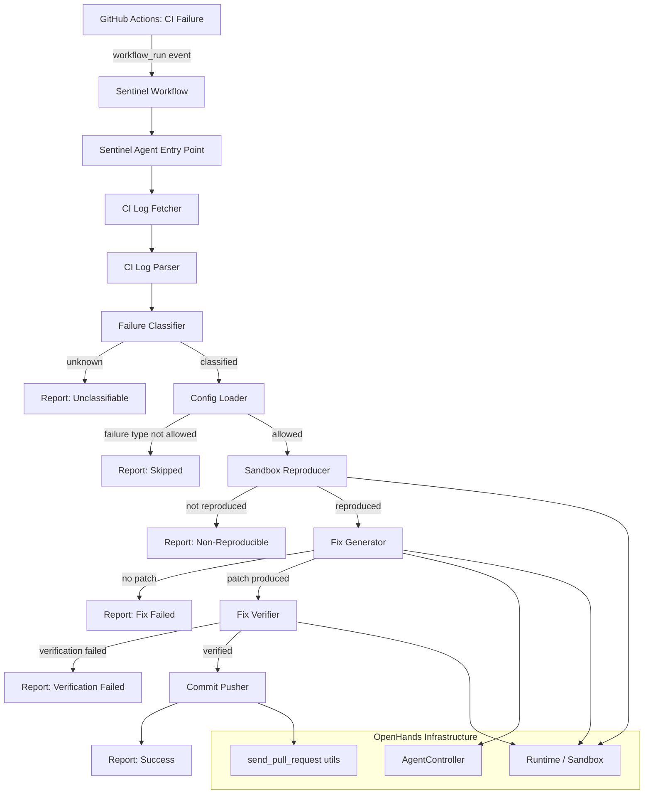

# Design Document: Project Sentinel (Autonomous CI/CD Repair)

## Overview

Project Sentinel adds an autonomous CI/CD repair agent to the OpenHands platform. It follows the same architectural pattern as the existing `openhands/resolver/` module (which resolves GitHub issues) but targets CI pipeline failures instead. When a GitHub Actions workflow fails, Sentinel parses the build logs, classifies the failure, reproduces it in a sandbox, generates a fix using the OpenHands agent, verifies the fix, and commits it back to the branch.

The implementation lives in a new `openhands/sentinel/` module and a companion GitHub Actions workflow. It reuses the existing `Runtime`, `AgentController`, and `send_pull_request` infrastructure rather than reimplementing them.

## Architecture



## Components and Interfaces

### 1. Sentinel Workflow (`sentinel-ci-repair.yml`)

A GitHub Actions reusable workflow triggered by `workflow_run` events with `conclusion: failure`. It installs OpenHands, invokes the Sentinel entry point, and handles artifact upload and PR commenting.

**Inputs**: `max_iterations`, `LLM_MODEL`, `allowed_failure_types`, `auto_commit`
**Secrets**: `LLM_API_KEY`, `PAT_TOKEN`

### 2. Sentinel Agent Entry Point (`openhands/sentinel/resolve_ci_failure.py`)

The CLI entry point, analogous to `openhands/resolver/resolve_issue.py`. Parses arguments, orchestrates the full repair pipeline, and writes output.

```python
class SentinelAgent:
    def __init__(self, args: Namespace) -> None: ...
    async def run(self) -> SentinelOutput: ...
```

**Arguments**: `--repo`, `--run-id`, `--token`, `--max-iterations`, `--llm-model`, `--output-dir`, `--config-path`

### 3. CI Log Fetcher (`openhands/sentinel/log_fetcher.py`)

Retrieves build logs from the GitHub Actions API for a given workflow run.

```python
class CILogFetcher:
    def __init__(self, token: str, repo: str) -> None: ...
    async def fetch_logs(self, run_id: int) -> WorkflowRunLogs: ...
    async def fetch_failed_jobs(self, run_id: int) -> list[FailedJob]: ...
```

### 4. CI Log Parser (`openhands/sentinel/log_parser.py`)

Extracts structured `FailureReport` objects from raw log text. Uses regex-based pattern matching for common failure patterns (pytest tracebacks, ruff output, npm/tsc errors, dependency resolution errors).

```python
class CILogParser:
    def parse(self, log_text: str, job_name: str) -> list[FailureReport]: ...
```

### 5. Failure Classifier (`openhands/sentinel/failure_classifier.py`)

Categorizes `FailureReport` objects into known failure types.

```python
class FailureClassifier:
    def classify(self, report: FailureReport) -> FailureType: ...
```

`FailureType` is an enum: `LINT_ERROR`, `TEST_FAILURE`, `DEPENDENCY_CONFLICT`, `BUILD_ERROR`, `UNKNOWN`.

### 6. Config Loader (`openhands/sentinel/config.py`)

Loads and validates `.sentinel.yml` from the repository root.

```python
class SentinelConfig:
    max_iterations: int = 30
    allowed_failure_types: list[FailureType] | None = None  # None = all
    excluded_paths: list[str] = []
    auto_commit: bool = True
    max_file_changes: int = 10

    @classmethod
    def load(cls, config_path: str | None = None) -> 'SentinelConfig': ...
```

### 7. Sandbox Reproducer (`openhands/sentinel/reproducer.py`)

Uses the OpenHands `Runtime` to spin up a sandbox, checkout the failing commit, and re-run the failed command.

```python
class SandboxReproducer:
    def __init__(self, runtime: Runtime) -> None: ...
    async def reproduce(self, failure: FailureReport, command: str) -> ReproductionResult: ...
```

`ReproductionResult` contains: `reproduced: bool`, `output: str`, `exit_code: int`.

### 8. Fix Generator (`openhands/sentinel/fix_generator.py`)

Wraps the `AgentController` to generate a fix. Constructs a prompt from the `FailureReport` and constrains the agent to only modify files in the report.

```python
class FixGenerator:
    def __init__(self, config: SentinelConfig, runtime: Runtime) -> None: ...
    async def generate_fix(
        self, failure: FailureReport, reproduction_output: str
    ) -> FixResult: ...
```

`FixResult` contains: `success: bool`, `patch: str | None`, `iterations_used: int`.

### 9. Fix Verifier (`openhands/sentinel/verifier.py`)

Applies the patch in the sandbox and re-runs the failed command plus the full test suite.

```python
class FixVerifier:
    def __init__(self, runtime: Runtime) -> None: ...
    async def verify(self, patch: str, failed_command: str, full_test_command: str) -> VerificationResult: ...
```

`VerificationResult` contains: `verified: bool`, `failed_command_output: str`, `full_test_output: str`.

### 10. Commit Pusher (`openhands/sentinel/commit_pusher.py`)

Reuses `openhands.resolver.send_pull_request.make_commit` and push utilities. Formats the commit message and pushes to the branch.

```python
class CommitPusher:
    def __init__(self, token: str, repo: str, username: str) -> None: ...
    async def push_fix(
        self, patch: str, branch: str, failed_step: str
    ) -> PushResult: ...
```

### 11. Report Generator (`openhands/sentinel/reporter.py`)

Produces structured `SentinelOutput` reports and posts them as PR comments / workflow artifacts.

```python
class ReportGenerator:
    def generate_report(self, attempt: RepairAttempt) -> SentinelOutput: ...
    async def post_pr_comment(self, repo: str, pr_number: int, report: SentinelOutput) -> bool: ...
```

## Data Models

All data models live in `openhands/sentinel/models.py` and use Pydantic `BaseModel` for validation and serialization.

```python
from enum import Enum
from pydantic import BaseModel


class FailureType(str, Enum):
    LINT_ERROR = "lint_error"
    TEST_FAILURE = "test_failure"
    DEPENDENCY_CONFLICT = "dependency_conflict"
    BUILD_ERROR = "build_error"
    UNKNOWN = "unknown"


class FailureReport(BaseModel):
    job_name: str
    step_name: str
    failure_type: FailureType
    error_messages: list[str]
    stack_traces: list[str]
    affected_files: list[str]
    affected_lines: dict[str, list[int]]  # file -> line numbers
    raw_log_snippet: str
    failed_command: str

    def to_json(self) -> str: ...

    @classmethod
    def from_json(cls, json_str: str) -> 'FailureReport': ...


class ReproductionResult(BaseModel):
    reproduced: bool
    output: str
    exit_code: int


class FixResult(BaseModel):
    success: bool
    patch: str | None
    iterations_used: int
    modified_files: list[str]


class VerificationResult(BaseModel):
    verified: bool
    failed_command_output: str
    full_test_output: str


class PushResult(BaseModel):
    success: bool
    commit_sha: str | None
    error_message: str | None


class RepairAttemptStatus(str, Enum):
    SUCCESS = "success"
    UNCLASSIFIABLE = "unclassifiable"
    NON_REPRODUCIBLE = "non_reproducible"
    FIX_FAILED = "fix_failed"
    VERIFICATION_FAILED = "verification_failed"
    PUSH_FAILED = "push_failed"
    SKIPPED = "skipped"
    ERROR = "error"


class RepairAttempt(BaseModel):
    run_id: int
    repo: str
    branch: str
    failure_report: FailureReport | None
    reproduction_result: ReproductionResult | None
    fix_result: FixResult | None
    verification_result: VerificationResult | None
    push_result: PushResult | None
    status: RepairAttemptStatus
    error_message: str | None


class SentinelOutput(BaseModel):
    repair_attempts: list[RepairAttempt]
    total_failures: int
    successful_repairs: int
    failed_repairs: int


class SentinelConfig(BaseModel):
    max_iterations: int = 30
    allowed_failure_types: list[FailureType] | None = None
    excluded_paths: list[str] = []
    auto_commit: bool = True
    max_file_changes: int = 10
```


## Correctness Properties

*A property is a characteristic or behavior that should hold true across all valid executions of a system — essentially, a formal statement about what the system should do. Properties serve as the bridge between human-readable specifications and machine-verifiable correctness guarantees.*

### Property 1: Failed job identification

*For any* workflow run structure containing a mix of passed and failed jobs/steps, the Sentinel Agent SHALL correctly identify all and only the jobs and steps with a failure status.

**Validates: Requirements 1.4**

### Property 2: Classifier returns valid FailureType

*For any* valid FailureReport, the Failure_Classifier SHALL return exactly one value from the FailureType enum (LINT_ERROR, TEST_FAILURE, DEPENDENCY_CONFLICT, BUILD_ERROR, or UNKNOWN).

**Validates: Requirements 2.2**

### Property 3: FailureReport round-trip serialization

*For any* valid FailureReport object, serializing it to JSON via `to_json()` and then deserializing via `from_json()` SHALL produce an object equivalent to the original.

**Validates: Requirements 2.5, 2.6**

### Property 4: Reproduction exit code mapping

*For any* integer exit code, the Sandbox_Reproducer SHALL set `reproduced=True` if and only if the exit code is non-zero, and `reproduced=False` if and only if the exit code is zero.

**Validates: Requirements 3.3, 3.4**

### Property 5: Prompt completeness

*For any* FailureReport and reproduction output string, the prompt constructed by the Fix_Generator SHALL contain the error messages from the FailureReport, the affected file paths, and the reproduction output.

**Validates: Requirements 4.2**

### Property 6: Modified files constraint

*For any* FixResult produced by the Fix_Generator, every file in `modified_files` SHALL be a member of the corresponding FailureReport's `affected_files` list.

**Validates: Requirements 4.5**

### Property 7: Verification exit code mapping

*For any* integer exit code from the re-run CI command, the Fix_Verifier SHALL set `verified=True` if and only if the exit code is zero, and `verified=False` if and only if the exit code is non-zero.

**Validates: Requirements 5.3, 5.4**

### Property 8: Commit message format

*For any* non-empty failed step name string, the commit message produced by the Commit_Pusher SHALL match the pattern `fix: auto-repair ci failure in <failed_step>`.

**Validates: Requirements 6.1**

### Property 9: Report completeness

*For any* RepairAttempt, the generated SentinelOutput report SHALL contain the failure type and status. Additionally, when the status is SUCCESS the report SHALL include the diff of the applied fix, and when the status is any failure state the report SHALL include a non-empty error message or failure reason.

**Validates: Requirements 7.1, 7.2, 7.3**

### Property 10: Allowed failure types filtering

*For any* SentinelConfig with a non-empty `allowed_failure_types` list and any FailureReport, the Sentinel Agent SHALL proceed with repair if and only if the FailureReport's failure_type is in the allowed list.

**Validates: Requirements 8.4**

### Property 11: Excluded paths filtering

*For any* SentinelConfig with a non-empty `excluded_paths` list and any FixResult, none of the files in `modified_files` SHALL match any pattern in `excluded_paths`.

**Validates: Requirements 8.5**

### Property 12: Max file change limit

*For any* FixResult accepted by the Sentinel Agent, the number of files in `modified_files` SHALL not exceed the `max_file_changes` value from the SentinelConfig.

**Validates: Requirements 8.7**

## Error Handling

| Scenario | Component | Behavior |
|---|---|---|
| GitHub API unreachable / error response | CILogFetcher | Log error, set status=ERROR, terminate gracefully |
| Build logs empty or unparseable | CILogParser | Return empty list of FailureReports, agent reports no actionable failures |
| Failure classified as UNKNOWN | FailureClassifier | Agent skips repair, sets status=UNCLASSIFIABLE |
| Failure type not in allowed list | SentinelAgent | Agent skips repair, sets status=SKIPPED |
| Sandbox fails to initialize | SandboxReproducer | Log error, set status=ERROR, terminate gracefully |
| Failed command passes in sandbox (exit 0) | SandboxReproducer | Agent skips repair, sets status=NON_REPRODUCIBLE |
| Agent exceeds max iterations | FixGenerator | Terminate fix generation, set status=FIX_FAILED |
| Fix modifies files outside affected_files | FixGenerator | Reject the fix, set status=FIX_FAILED |
| Fix modifies more than max_file_changes files | FixGenerator | Reject the fix, set status=FIX_FAILED |
| Fix modifies excluded paths | FixGenerator | Reject the fix, set status=FIX_FAILED |
| Patch fails to apply | FixVerifier | Set status=VERIFICATION_FAILED |
| Re-run command fails after patch | FixVerifier | Discard fix, set status=VERIFICATION_FAILED |
| Full test suite fails after patch | FixVerifier | Discard fix, set status=VERIFICATION_FAILED |
| Git push conflict or permission error | CommitPusher | Log error, set status=PUSH_FAILED |
| Invalid .sentinel.yml | ConfigLoader | Log warning, fall back to defaults |
| Missing .sentinel.yml | ConfigLoader | Use default configuration silently |

## Testing Strategy

### Property-Based Testing

Use `hypothesis` (Python) as the property-based testing library. Each property test runs a minimum of 100 iterations.

Property tests target the core logic components that have well-defined input/output contracts:
- **Models**: FailureReport serialization round-trip, FailureType enum coverage
- **Classifier**: Always returns valid FailureType
- **Reproducer logic**: Exit code → reproduced mapping
- **Verifier logic**: Exit code → verified mapping
- **Config filtering**: Allowed types, excluded paths, file change limits
- **Commit message formatting**: Format string correctness
- **Report generation**: Completeness based on attempt status
- **Prompt construction**: Contains required context

Each property test is tagged with: `Feature: sentinel-cicd-repair, Property {N}: {title}`

### Unit Testing

Unit tests complement property tests by covering:
- Specific known log formats (pytest tracebacks, ruff output, tsc errors)
- Config loading from valid/invalid/missing YAML files
- GitHub API response handling (mocked)
- PR comment posting (mocked)
- Edge cases: empty logs, zero failures, all failures unknown

### Integration Testing

Integration tests (run separately, not in CI by default):
- End-to-end flow with a mock GitHub API and local sandbox
- Workflow YAML validation

### Test File Layout

```
tests/unit/test_sentinel_models.py        # Property tests for models + serialization
tests/unit/test_sentinel_log_parser.py     # Unit tests for log parsing
tests/unit/test_sentinel_classifier.py     # Property + unit tests for classification
tests/unit/test_sentinel_reproducer.py     # Property tests for exit code mapping
tests/unit/test_sentinel_verifier.py       # Property tests for verification logic
tests/unit/test_sentinel_config.py         # Unit + property tests for config
tests/unit/test_sentinel_commit_pusher.py  # Property tests for commit message format
tests/unit/test_sentinel_reporter.py       # Property tests for report completeness
tests/unit/test_sentinel_fix_generator.py  # Property tests for prompt + file constraints
```
