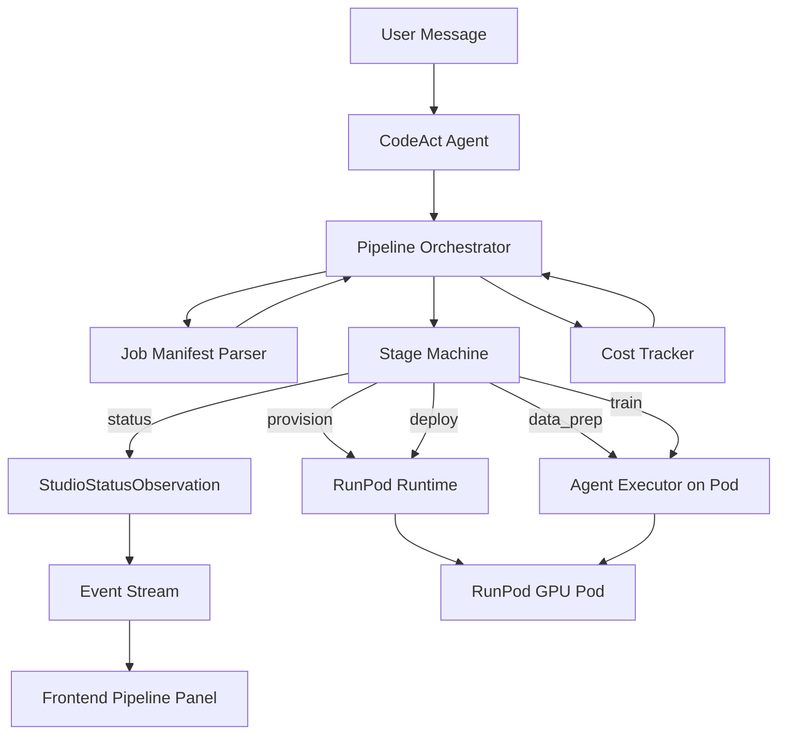

# Design Document: Studio Mode (RunPod AI Lab)

## Overview

Studio Mode adds a specialized AI workload orchestration layer on top of the existing OpenHands agent and RunPod runtime infrastructure. When a user describes an AI task in natural language, a Pipeline Orchestrator decomposes it into discrete stages (parse → provision → data prep → train → deploy), coordinates execution on a GPU pod, and streams progress back to the frontend via structured events.

The design builds on:
- The existing RunPod runtime integration (`docs/runpod-integration-design.md`) for pod lifecycle management.
- The existing event/observation system (`openhands/events/`) for streaming status to the frontend.
- The existing agent architecture for LLM-driven code generation and execution.

Key design decisions:
1. **Pipeline as agent-driven code generation** — rather than hard-coding training scripts, the agent generates scripts dynamically based on the Job Manifest, leveraging its existing code generation capabilities.
2. **Thin orchestration layer** — the Pipeline Orchestrator is a state machine that sequences stages and delegates actual work to the agent + RunPod runtime.
3. **Event-driven frontend** — Studio Mode UI components subscribe to a new `StudioStatusObservation` event type, keeping the frontend decoupled from backend pipeline logic.

## Architecture



### Data Flow

1. User sends a natural language message describing an AI workload.
2. The agent recognizes it as a Studio Mode task and invokes the Pipeline Orchestrator.
3. The Pipeline Orchestrator uses the LLM to parse the message into a Job Manifest.
4. The user confirms the plan. The orchestrator advances through stages:
   - **provision**: Calls RunPod Runtime to create a GPU pod.
   - **data_prep**: Agent generates and executes data scraping/processing scripts on the pod.
   - **train**: Agent generates training config, executes training, polls for metrics.
   - **deploy**: Agent deploys model as endpoint, verifies health.
5. Each stage transition emits a `StudioStatusObservation` to the event stream.
6. The frontend renders a pipeline progress panel from these events.

## Components and Interfaces

### 1. Job Manifest Parser (`openhands/studio/manifest.py`)

Responsible for parsing user intent into a structured Job Manifest and serializing/deserializing manifests.

```python
from dataclasses import dataclass, field
from enum import Enum
import json

class TaskType(Enum):
    FINE_TUNE = "fine_tune"
    RAG_SETUP = "rag_setup"
    INFERENCE_DEPLOY = "inference_deploy"

class TrainingFramework(Enum):
    AXOLOTL = "axolotl"
    UNSLOTH = "unsloth"
    CUSTOM = "custom"

@dataclass
class GPUSpec:
    gpu_type: str  # e.g. "NVIDIA H100 80GB"
    gpu_count: int = 1
    container_image: str = "runpod/pytorch:2.1.0-py3.10-cuda12.1.0-devel-ubuntu22.04"
    disk_size_gb: int = 100
    volume_size_gb: int = 50

@dataclass
class JobManifest:
    task_type: TaskType
    base_model: str  # e.g. "meta-llama/Llama-3-8B"
    data_source: str  # URL, repo path, or local path
    framework: TrainingFramework
    gpu_spec: GPUSpec
    hyperparameters: dict = field(default_factory=dict)
    deployment_target: str = "serverless"  # "serverless" or "pod"
    pipeline_stages: list[str] = field(default_factory=list)

    def to_json(self) -> str:
        """Serialize to JSON string."""
        ...

    @classmethod
    def from_json(cls, json_str: str) -> "JobManifest":
        """Deserialize from JSON string."""
        ...
```

### 2. Pipeline Orchestrator (`openhands/studio/orchestrator.py`)

A state machine that sequences pipeline stages and coordinates execution.

```python
from enum import Enum

class StageStatus(Enum):
    PENDING = "pending"
    RUNNING = "running"
    COMPLETED = "completed"
    FAILED = "failed"
    SKIPPED = "skipped"

@dataclass
class PipelineStage:
    name: str  # e.g. "provision", "data_prep", "train", "deploy"
    status: StageStatus = StageStatus.PENDING
    details: dict = field(default_factory=dict)
    error: str | None = None

class PipelineOrchestrator:
    def __init__(self, manifest: JobManifest, runtime: RunPodRuntime, event_stream: EventStream):
        self.manifest = manifest
        self.runtime = runtime
        self.event_stream = event_stream
        self.stages: list[PipelineStage] = []
        self.cost_tracker = CostTracker(manifest.gpu_spec)

    async def run(self) -> None:
        """Execute all pipeline stages in sequence."""
        ...

    async def execute_stage(self, stage: PipelineStage) -> None:
        """Execute a single stage, emitting status events."""
        ...

    def emit_status(self, stage: PipelineStage, metrics: dict | None = None) -> None:
        """Emit a StudioStatusObservation to the event stream."""
        ...

    def get_pipeline_summary(self) -> dict:
        """Return a summary of all stages and their statuses."""
        ...
```

### 3. Studio Status Observation (`openhands/events/observation/studio.py`)

A new observation type for streaming pipeline progress.

```python
@dataclass
class StudioStatusObservation(Observation):
    stage_name: str
    stage_status: str  # "pending", "running", "completed", "failed"
    details: dict = field(default_factory=dict)
    metrics: dict = field(default_factory=dict)
    error: str | None = None
    cost_estimate: float | None = None
    observation: str = ObservationType.STUDIO_STATUS

    @property
    def message(self) -> str:
        return f"Studio [{self.stage_name}]: {self.stage_status}"
```

### 4. Cost Tracker (`openhands/studio/cost_tracker.py`)

Tracks GPU time and estimates cost.

```python
GPU_HOURLY_RATES = {
    "NVIDIA H100 80GB": 3.89,
    "NVIDIA A100 80GB PCIe": 1.64,
    "NVIDIA RTX A6000": 0.76,
    "NVIDIA RTX 4090": 0.69,
}

@dataclass
class CostTracker:
    gpu_spec: GPUSpec
    start_time: float | None = None
    end_time: float | None = None

    def start(self) -> None: ...
    def stop(self) -> None: ...

    @property
    def elapsed_seconds(self) -> float: ...

    @property
    def estimated_cost(self) -> float:
        """Compute cost = (elapsed_hours) * hourly_rate * gpu_count."""
        ...
```

### 5. Frontend Components

#### Pipeline Progress Panel (`frontend/src/components/features/studio/`)

```
frontend/src/components/features/studio/
├── StudioPipelinePanel.tsx      # Main panel showing pipeline stages
├── StudioStageCard.tsx          # Individual stage card with status
├── StudioTrainingMetrics.tsx    # Live training metrics display
├── StudioSummaryPanel.tsx       # Final summary with endpoint + cost
└── studio-types.ts              # TypeScript types for studio events
```

#### TypeScript Types (`studio-types.ts`)

```typescript
export type StageStatus = "pending" | "running" | "completed" | "failed" | "skipped";

export interface PipelineStageInfo {
  name: string;
  status: StageStatus;
  details: Record<string, unknown>;
  metrics: Record<string, number>;
  error?: string;
  costEstimate?: number;
}

export interface StudioStatusEvent {
  stageName: string;
  stageStatus: StageStatus;
  details: Record<string, unknown>;
  metrics: Record<string, number>;
  error?: string;
  costEstimate?: number;
}
```

#### TanStack Query Integration

Following the project's data access patterns:
- `frontend/src/hooks/query/use-studio-session.ts` — query hook for studio session state
- `frontend/src/hooks/mutation/use-confirm-studio-plan.ts` — mutation for confirming a job manifest

The pipeline panel subscribes to `StudioStatusObservation` events via the existing WebSocket event stream, filtering by observation type.

### 6. GPU Spec Resolution (`openhands/studio/gpu_resolver.py`)

Maps task requirements to appropriate GPU configurations with fallback logic.

```python
GPU_FALLBACK_ORDER = [
    "NVIDIA H100 80GB",
    "NVIDIA A100 80GB PCIe",
    "NVIDIA RTX A6000",
    "NVIDIA RTX 4090",
]

def resolve_gpu_spec(task_type: TaskType, base_model: str) -> GPUSpec:
    """Determine GPU requirements based on task and model size."""
    ...

def get_fallback_gpu(current_gpu: str) -> str | None:
    """Return the next GPU in the fallback order, or None if exhausted."""
    ...
```

## Data Models

### Job Manifest JSON Schema

```json
{
  "task_type": "fine_tune",
  "base_model": "meta-llama/Llama-3-8B",
  "data_source": "https://docs.example.com",
  "framework": "axolotl",
  "gpu_spec": {
    "gpu_type": "NVIDIA H100 80GB",
    "gpu_count": 1,
    "container_image": "runpod/pytorch:2.1.0-py3.10-cuda12.1.0-devel-ubuntu22.04",
    "disk_size_gb": 100,
    "volume_size_gb": 50
  },
  "hyperparameters": {
    "learning_rate": 2e-5,
    "epochs": 3,
    "batch_size": 4,
    "lora_rank": 16
  },
  "deployment_target": "serverless",
  "pipeline_stages": ["provision", "data_prep", "train", "deploy"]
}
```

### Pipeline State Model

```python
@dataclass
class PipelineState:
    session_id: str
    manifest: JobManifest
    stages: list[PipelineStage]
    pod_id: str | None = None
    endpoint_url: str | None = None
    total_cost: float = 0.0
    started_at: str | None = None
    completed_at: str | None = None
```

### StudioStatusObservation Event Payload

```json
{
  "observation": "studio_status",
  "stage_name": "train",
  "stage_status": "running",
  "details": {"command": "axolotl train config.yml"},
  "metrics": {"loss": 0.342, "epoch": 1, "step": 150},
  "error": null,
  "cost_estimate": 2.45
}
```


## Correctness Properties

*A property is a characteristic or behavior that should hold true across all valid executions of a system — essentially, a formal statement about what the system should do. Properties serve as the bridge between human-readable specifications and machine-verifiable correctness guarantees.*

### Property 1: Manifest Validation Completeness

*For any* set of Job Manifest fields where all required fields (task_type, base_model, data_source, framework, gpu_spec) are present and valid, constructing a JobManifest SHALL succeed. *For any* set where one or more required fields are missing or invalid, the validator SHALL reject the input and identify the specific missing/invalid fields.

**Validates: Requirements 1.1, 1.2**

### Property 2: Pipeline Summary Contains All Stages

*For any* valid JobManifest, calling `get_pipeline_summary()` SHALL return a summary containing exactly the stages listed in the manifest's `pipeline_stages` field, each with a valid status.

**Validates: Requirements 1.3**

### Property 3: GPU Fallback Ordering

*For any* GPU type that is not the last entry in the fallback list, `get_fallback_gpu()` SHALL return the next GPU type in the ranked fallback order. For the last entry, it SHALL return None. For any GPU type not in the list, it SHALL return None.

**Validates: Requirements 2.3**

### Property 4: Dataset Validation Correctness

*For any* file metadata (path, size, format_valid flag), the dataset validator SHALL accept files that exist, have non-zero size, and have valid format structure, and SHALL reject files that fail any of these checks.

**Validates: Requirements 3.3**

### Property 5: Training Metrics Parsing

*For any* training output line containing metrics in the expected format (e.g., `loss: X.XXX, epoch: N, step: M`), the metrics parser SHALL extract the correct numeric values for loss, epoch, and step. For lines not matching the expected format, the parser SHALL return an empty metrics dict.

**Validates: Requirements 4.3**

### Property 6: Curl Command Generation

*For any* non-empty endpoint URL string, the generated curl command SHALL contain the URL and SHALL be a syntactically valid shell command (starting with `curl` and containing the URL as a substring).

**Validates: Requirements 5.2**

### Property 7: Pipeline State Consistency From Events

*For any* initial pipeline state and any sequence of StudioStatusObservation events, applying the events in order SHALL produce a pipeline state where each stage's status matches the last event received for that stage.

**Validates: Requirements 6.1, 6.2**

### Property 8: Cost Computation Accuracy

*For any* GPU type with a known hourly rate, any positive gpu_count, and any non-negative elapsed time in seconds, the estimated cost SHALL equal `(elapsed_seconds / 3600) * hourly_rate * gpu_count`.

**Validates: Requirements 7.1**

### Property 9: Idle Session Detection

*For any* last-activity timestamp, current timestamp, and configurable timeout value, the idle detector SHALL return `True` if and only if `(current_time - last_activity_time) > timeout`.

**Validates: Requirements 7.3**

### Property 10: Job Manifest Serialization Round-Trip

*For any* valid JobManifest object, serializing it to JSON via `to_json()` and then deserializing via `from_json()` SHALL produce a JobManifest that is equivalent to the original.

**Validates: Requirements 8.1, 8.2, 8.3**

## Error Handling

| Scenario | Handling Strategy | User Impact |
|---|---|---|
| LLM fails to parse user intent into manifest | Return partial manifest, prompt user for missing fields | User sees a clarification question |
| RunPod API key missing or invalid | Raise configuration error before provisioning | User sees setup instructions |
| GPU type unavailable on RunPod | Retry with fallback GPU from ranked list (Property 3) | User notified of fallback GPU selection |
| Pod provisioning timeout (>5 min) | Delete failed pod, emit error StudioStatusObservation | User sees failed "provision" stage with retry option |
| GPU verification fails on running pod | Terminate pod, emit error event | User sees error with suggestion to try different GPU |
| Data scraping script fails | Capture stderr, emit error event with output | User sees error with command output and suggestions |
| Dataset validation fails | Emit error event with specific validation failures | User sees which checks failed (size, format, etc.) |
| Training job crashes | Capture error output, suggest remediation (reduce batch size, switch GPU) | User sees error with actionable suggestions |
| Endpoint deployment fails | Emit error event, provide manual deployment instructions | User gets fallback instructions |
| Idle timeout reached | Stop pod, emit final cost event, notify user | User notified, can re-provision |
| WebSocket disconnection during pipeline | Frontend reconnects and fetches latest pipeline state | User sees current state after reconnect |

## Testing Strategy

### Property-Based Testing

- **Library**: [Hypothesis](https://hypothesis.readthedocs.io/) for Python backend tests
- **Minimum iterations**: 100 per property test
- **Tag format**: `# Feature: studio-mode-runpod, Property N: <property_text>`

Each correctness property (1–10) maps to a single property-based test:

| Property | Test Location | Generator Strategy |
|---|---|---|
| 1: Manifest Validation | `tests/unit/test_studio_manifest.py` | Generate random field combinations with `st.one_of(st.none(), st.text())` for each field |
| 2: Pipeline Summary | `tests/unit/test_studio_orchestrator.py` | Generate valid manifests with random stage lists |
| 3: GPU Fallback | `tests/unit/test_studio_gpu_resolver.py` | Generate GPU types from the fallback list + random strings |
| 4: Dataset Validation | `tests/unit/test_studio_orchestrator.py` | Generate file metadata tuples (path, size, format_valid) |
| 5: Metrics Parsing | `tests/unit/test_studio_orchestrator.py` | Generate training output lines with random numeric values |
| 6: Curl Command | `tests/unit/test_studio_orchestrator.py` | Generate random URL strings |
| 7: Pipeline State | `tests/unit/test_studio_pipeline_state.py` | Generate random sequences of StudioStatusObservation events |
| 8: Cost Computation | `tests/unit/test_studio_cost_tracker.py` | Generate random GPU types, counts, and elapsed times |
| 9: Idle Detection | `tests/unit/test_studio_cost_tracker.py` | Generate random timestamps and timeout values |
| 10: Manifest Round-Trip | `tests/unit/test_studio_manifest.py` | Generate random valid JobManifest objects |

### Unit Testing

Unit tests complement property tests for specific examples and edge cases:

- **Manifest parsing**: Test specific known-good and known-bad manifest JSON strings
- **GPU fallback**: Test specific GPU types at boundaries (first, last, unknown)
- **Cost tracker**: Test zero elapsed time, very large elapsed time
- **Metrics parser**: Test specific training framework output formats (Axolotl, Unsloth)
- **Error paths**: Test each error scenario from the Error Handling table

### Frontend Testing

- **Framework**: vitest
- **Component tests**: Render StudioPipelinePanel with mock data, verify stage cards render correctly
- **Event handling tests**: Simulate StudioStatusObservation events, verify state updates
- **Snapshot tests**: For StudioSummaryPanel with known endpoint/cost data
