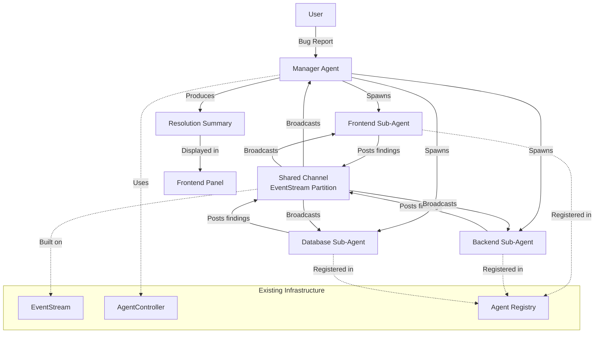
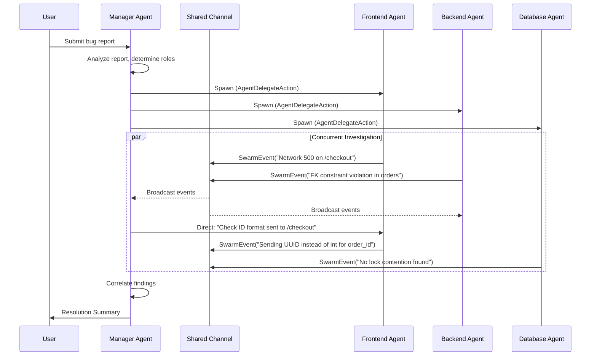

# Design Document: Swarm Debugging (Multi-Agent Collaboration)

## Overview

This design introduces a multi-agent "swarm" debugging system into OpenHands. The core idea is that a Manager Agent orchestrates multiple specialized Sub-Agents that investigate different layers of a bug concurrently. Agents communicate through a shared channel built on top of the existing EventStream, and the Manager Agent synthesizes findings into a Resolution Summary.

The design builds on the existing `AgentController` delegation pattern (`AgentDelegateAction`), the `EventStream` pub/sub system, and the `Agent` base class registry. Rather than creating parallel infrastructure, the swarm is modeled as a coordinated set of delegates sharing a namespaced event partition.

### Key Design Decisions

1. **Reuse over rebuild**: The swarm uses `AgentDelegateAction`, `EventStream`, and `AgentController` rather than introducing new communication primitives.
2. **Shared EventStream with namespace tags**: Swarm events are regular events in the existing stream, tagged with a `swarm_session_id` and `agent_role` so agents can filter for relevant messages.
3. **Manager as orchestrator, not participant**: The Manager Agent does not investigate directly — it spawns, monitors, and synthesizes.
4. **Concurrent delegates**: Unlike the current sequential delegation model (one delegate at a time), the swarm controller manages multiple concurrent delegates.

## Architecture



### Sequence Diagram: Swarm Session Lifecycle



## Components and Interfaces

### 1. SwarmController

Extends the orchestration logic to manage multiple concurrent delegates. Lives alongside `AgentController`.

```python
# openhands/controller/swarm_controller.py

@dataclass
class SwarmConfig:
    max_sub_agents: int = 5
    session_timeout_seconds: int = 600
    max_iterations_per_sub_agent: int = 50
    budget_per_sub_agent: float | None = None

class SwarmController:
    def __init__(
        self,
        session_id: str,
        manager_controller: AgentController,
        event_stream: EventStream,
        config: SwarmConfig,
    ):
        self.session_id = session_id
        self.manager_controller = manager_controller
        self.event_stream = event_stream
        self.config = config
        self.sub_agents: dict[str, AgentController] = {}
        self.shared_channel = SharedChannel(session_id, event_stream)
        self.status: SwarmSessionStatus = SwarmSessionStatus.PENDING

    async def spawn_sub_agent(self, role: AgentRole, task: str) -> str:
        """Spawn a sub-agent with the given role. Returns the sub-agent ID."""
        ...

    async def terminate_sub_agent(self, agent_id: str, reason: str) -> None:
        """Terminate a specific sub-agent."""
        ...

    async def check_progress(self) -> SwarmProgress:
        """Check the progress of all sub-agents."""
        ...

    async def produce_resolution(self) -> ResolutionSummary:
        """Aggregate findings and produce a resolution summary."""
        ...

    async def close(self) -> None:
        """Clean up all sub-agents and the shared channel."""
        ...
```

### 2. SharedChannel

A namespaced view over the EventStream that filters events by `swarm_session_id`.

```python
# openhands/controller/swarm_channel.py

@dataclass
class SwarmEvent:
    swarm_session_id: str
    agent_role: str
    agent_id: str
    content: str
    event_type: SwarmEventType  # FINDING, QUESTION, CONCLUSION, DIRECTIVE
    timestamp: str
    correlation_id: str | None = None  # links related findings

class SharedChannel:
    def __init__(self, session_id: str, event_stream: EventStream):
        self.session_id = session_id
        self.event_stream = event_stream

    def post(self, event: SwarmEvent) -> None:
        """Post a SwarmEvent to the channel via the EventStream."""
        ...

    def get_events(self, since_id: int | None = None) -> list[SwarmEvent]:
        """Retrieve SwarmEvents for this session, optionally since a given event ID."""
        ...

    def get_events_by_role(self, role: str) -> list[SwarmEvent]:
        """Retrieve SwarmEvents filtered by agent role."""
        ...
```

### 3. AgentRole Registry

A registry of available agent specializations with their tool configurations.

```python
# openhands/controller/swarm_roles.py

@dataclass
class AgentRole:
    name: str  # e.g., "frontend", "backend", "database"
    agent_class: str  # registered Agent class name
    description: str
    tools: list[str]  # tool names available to this role
    system_prompt_suffix: str  # additional context for the agent's system prompt

class AgentRoleRegistry:
    _roles: dict[str, AgentRole] = {}

    @classmethod
    def register(cls, role: AgentRole) -> None:
        """Register a new agent role."""
        ...

    @classmethod
    def get(cls, name: str) -> AgentRole:
        """Get a role by name."""
        ...

    @classmethod
    def list_roles(cls) -> list[str]:
        """List all registered role names."""
        ...
```

### 4. SwarmManagerAgent

A new agent type that extends `Agent` and implements the orchestration logic.

```python
# openhands/agenthub/swarm_manager_agent/swarm_manager_agent.py

class SwarmManagerAgent(Agent):
    """Manager agent that orchestrates a swarm of specialized sub-agents."""

    def step(self, state: State) -> Action:
        """
        Orchestration loop:
        1. If no swarm started: analyze bug report, determine roles, spawn sub-agents
        2. If swarm active: read shared channel, correlate findings, direct sub-agents
        3. If all done or timeout: produce resolution summary
        """
        ...

    def analyze_bug_report(self, report: str) -> list[str]:
        """Use LLM to determine which agent roles are needed."""
        ...

    def correlate_findings(self, events: list[SwarmEvent]) -> list[Correlation]:
        """Identify correlations and contradictions between findings."""
        ...

    def synthesize_resolution(
        self, events: list[SwarmEvent], correlations: list[Correlation]
    ) -> ResolutionSummary:
        """Produce the final resolution summary."""
        ...
```

### 5. Specialized Sub-Agent Roles

Default role configurations for the three core specializations.

```python
# Default roles registered at startup

FRONTEND_ROLE = AgentRole(
    name="frontend",
    agent_class="BrowsingAgent",
    description="Investigates frontend issues: reproduces click paths, captures network logs",
    tools=["browse_url", "browse_interactive", "network_capture"],
    system_prompt_suffix="You are investigating a frontend bug. Focus on reproducing the user's click path, capturing network requests, and identifying client-side errors.",
)

BACKEND_ROLE = AgentRole(
    name="backend",
    agent_class="CodeActAgent",
    description="Investigates backend issues: tails logs, finds exceptions, traces request flow",
    tools=["cmd_run", "file_read", "ipython"],
    system_prompt_suffix="You are investigating a backend bug. Focus on server logs, exception traces, and request handling code.",
)

DATABASE_ROLE = AgentRole(
    name="database",
    agent_class="CodeActAgent",
    description="Investigates database issues: checks queries, locks, timeouts",
    tools=["cmd_run", "ipython"],
    system_prompt_suffix="You are investigating a database bug. Focus on query performance, lock contention, constraint violations, and data integrity.",
)
```

### 6. Frontend Components

```typescript
// frontend/src/components/features/swarm/swarm-panel.tsx
interface SwarmPanelProps {
  sessionId: string;
}

// Displays the swarm debugging panel with:
// - Active sub-agents list with role labels and status indicators
// - Shared timeline of SwarmEvents
// - Resolution summary display
// - User message input for the shared channel

// frontend/src/hooks/query/use-swarm-session.ts
// TanStack Query hook for fetching swarm session state

// frontend/src/hooks/query/use-swarm-events.ts
// TanStack Query hook for polling swarm events

// frontend/src/hooks/mutation/use-send-swarm-message.ts
// Mutation hook for user messages to the shared channel
```

### 7. Backend API Endpoints

```python
# openhands/server/routes/swarm.py

# GET /api/swarm/{session_id}/status
# Returns the current swarm session status and sub-agent states

# GET /api/swarm/{session_id}/events
# Returns swarm events, supports ?since_id= for polling

# POST /api/swarm/{session_id}/message
# Posts a user message to the shared channel

# GET /api/swarm/{session_id}/resolution
# Returns the resolution summary once available
```

## Data Models

### SwarmSessionStatus

```python
class SwarmSessionStatus(str, Enum):
    PENDING = "pending"        # Manager analyzing bug report
    ACTIVE = "active"          # Sub-agents investigating
    RESOLVING = "resolving"    # Manager synthesizing findings
    COMPLETED = "completed"    # Resolution summary produced
    FAILED = "failed"          # Unrecoverable error
```

### SwarmEventType

```python
class SwarmEventType(str, Enum):
    FINDING = "finding"        # An observation or discovery
    QUESTION = "question"      # A question for other agents
    CONCLUSION = "conclusion"  # A definitive conclusion
    DIRECTIVE = "directive"    # Manager directing a sub-agent
    USER_MESSAGE = "user_message"  # User input to the channel
    STATUS_UPDATE = "status_update"  # Agent status change
```

### SubAgentState

```python
@dataclass
class SubAgentState:
    agent_id: str
    role: str
    status: str  # "investigating", "complete", "failed"
    findings: list[SwarmEvent]
    started_at: str
    completed_at: str | None = None
    failure_reason: str | None = None
```

### ResolutionSummary

```python
@dataclass
class ResolutionSummary:
    swarm_session_id: str
    root_cause: str
    recommended_fix: str
    findings_by_role: dict[str, list[SwarmEvent]]
    timeline: list[SwarmEvent]
    sub_agent_states: list[SubAgentState]
    created_at: str

    def serialize(self) -> dict:
        """Serialize to a dictionary for JSON storage."""
        ...

    @classmethod
    def deserialize(cls, data: dict) -> "ResolutionSummary":
        """Deserialize from a dictionary."""
        ...
```

### Correlation

```python
@dataclass
class Correlation:
    event_ids: list[int]
    correlation_type: str  # "contradiction", "confirmation", "causal"
    description: str
```

### SwarmAction (New Event Action)

```python
# openhands/events/action/swarm.py

@dataclass
class SwarmSpawnAction(Action):
    """Action to spawn a sub-agent in a swarm."""
    role: str
    task: str
    swarm_session_id: str
    action: str = ActionType.SWARM_SPAWN

@dataclass
class SwarmMessageAction(Action):
    """Action to post a message to the swarm shared channel."""
    content: str
    swarm_session_id: str
    agent_role: str
    event_type: str  # SwarmEventType value
    action: str = ActionType.SWARM_MESSAGE
```

### SwarmObservation (New Event Observation)

```python
# openhands/events/observation/swarm.py

@dataclass
class SwarmEventObservation(Observation):
    """Observation containing a swarm event from the shared channel."""
    swarm_session_id: str
    agent_role: str
    event_type: str
    content: str
    observation: str = ObservationType.SWARM_EVENT

@dataclass
class SwarmResolutionObservation(Observation):
    """Observation containing the final resolution summary."""
    swarm_session_id: str
    resolution: dict  # serialized ResolutionSummary
    observation: str = ObservationType.SWARM_RESOLUTION
```


## Correctness Properties

*A property is a characteristic or behavior that should hold true across all valid executions of a system — essentially, a formal statement about what the system should do. Properties serve as the bridge between human-readable specifications and machine-verifiable correctness guarantees.*

### Property 1: Role determination returns valid roles

*For any* bug report string, the Manager Agent's `analyze_bug_report` function shall return a non-empty list where every element is a registered Agent_Role name.

**Validates: Requirements 1.1**

### Property 2: Spawn count matches determined roles

*For any* list of Agent_Roles determined by the Manager Agent, the SwarmController shall spawn exactly one Sub_Agent per role, and the set of spawned agent roles shall equal the set of determined roles.

**Validates: Requirements 1.2**

### Property 3: Session cleanup leaves no residual state

*For any* SwarmController with any number of active sub-agents, after calling `close()`, the `sub_agents` dictionary shall be empty and the session status shall be `COMPLETED` or `FAILED`.

**Validates: Requirements 1.5**

### Property 4: Role registration preserves existing roles

*For any* AgentRoleRegistry state and any new AgentRole, registering the new role shall make it available via `get()` while all previously registered roles remain accessible and unchanged.

**Validates: Requirements 2.5**

### Property 5: Channel creation per session

*For any* SwarmController initialization with a given session_id, the associated SharedChannel's session_id shall match the SwarmController's session_id.

**Validates: Requirements 3.1**

### Property 6: Event broadcast visibility

*For any* SwarmEvent posted to a SharedChannel, calling `get_events()` on that channel shall return a list containing that event.

**Validates: Requirements 3.2**

### Property 7: Event structure completeness

*For any* SwarmEvent posted to the SharedChannel, the retrieved event shall contain a non-empty `agent_role`, a non-empty `timestamp`, and non-empty `content`.

**Validates: Requirements 3.3**

### Property 8: Resolution summary completeness

*For any* set of sub-agent findings across N roles, the produced ResolutionSummary shall contain: (a) entries in `findings_by_role` for each role that produced findings, (b) a non-empty `root_cause`, (c) a non-empty `recommended_fix`, and (d) a `timeline` with events ordered chronologically.

**Validates: Requirements 4.1, 4.2, 4.3**

### Property 9: Resolution summary serialization round-trip

*For any* valid ResolutionSummary object, serializing it via `serialize()` and then deserializing via `deserialize()` shall produce an object equal to the original.

**Validates: Requirements 4.4, 4.5**

### Property 10: Sub-agent panel renders all agents

*For any* list of SubAgentState objects, the SwarmPanel component shall render one agent entry per state, each displaying the correct role label.

**Validates: Requirements 5.1**

### Property 11: Event timeline renders role and timestamp

*For any* SwarmEvent, the timeline component shall render output containing the event's `agent_role` and `timestamp`.

**Validates: Requirements 5.2**

### Property 12: Sub-agent failure does not halt session

*For any* SwarmController with N > 1 active sub-agents, when one sub-agent is marked as failed, the session status shall remain `ACTIVE` and the remaining N-1 sub-agents shall continue operating.

**Validates: Requirements 6.1**

### Property 13: Failure details included in resolution

*For any* sub-agent that fails during a swarm session, the resulting ResolutionSummary shall contain a SubAgentState entry for that agent with status "failed" and a non-empty `failure_reason`.

**Validates: Requirements 6.2**

### Property 14: Budget-exceeded agent is terminated and scope redistributed

*For any* sub-agent that exceeds its iteration or budget limit, the SwarmController shall terminate that agent and the remaining active sub-agents shall receive an updated task scope.

**Validates: Requirements 6.5**

## Error Handling

### Sub-Agent Failures

- When a sub-agent's `AgentController` raises an exception or enters an error state, the `SwarmController.check_progress()` method detects it and marks the agent as failed.
- The failure reason is captured from the exception or the agent's state and stored in `SubAgentState.failure_reason`.
- The Manager Agent is notified via a `STATUS_UPDATE` SwarmEvent so it can adjust its orchestration strategy.

### Manager Agent Failure

- If the Manager Agent itself fails, the `SwarmController` catches the exception and transitions to `FAILED` status.
- All SwarmEvents collected up to that point are preserved in the EventStream (they're already persisted there).
- The frontend detects the `FAILED` status and displays the raw event timeline to the user.

### Timeout Handling

- The `SwarmConfig.session_timeout_seconds` sets a hard limit on session duration.
- When the timeout is reached, `SwarmController` terminates all active sub-agents and triggers resolution with whatever findings exist.
- Individual sub-agent timeouts are handled by the existing `AgentController` iteration/budget limits.

### Budget Exceeded

- When a sub-agent hits its iteration or budget limit (detected via `ControlFlag.reached_limit()`), the `SwarmController` terminates it.
- The Manager Agent receives a directive to redistribute the terminated agent's investigation scope to remaining agents.

### EventStream Errors

- If the EventStream encounters an error during event posting, the `SharedChannel.post()` method retries once, then raises a `SwarmChannelError`.
- The `SwarmController` catches this and logs it without terminating the session, since other agents can continue.

## Testing Strategy

### Property-Based Testing

Property-based tests will use `hypothesis` (Python) and `fast-check` (TypeScript/frontend) with a minimum of 100 iterations per property.

Each property test must be tagged with: **Feature: swarm-debugging, Property {number}: {property_text}**

Backend property tests:
- Property 1: Generate random bug report strings → verify role determination returns valid registered roles
- Property 2: Generate random role lists → verify spawn count and role set equality
- Property 3: Generate swarm controllers with random sub-agent counts → verify cleanup
- Property 4: Generate random role registries and new roles → verify preservation
- Property 5: Generate random session IDs → verify channel-session ID match
- Property 6: Generate random SwarmEvents → verify retrieval after posting
- Property 7: Generate random SwarmEvents → verify field completeness
- Property 8: Generate random findings across random roles → verify summary completeness
- Property 9: Generate random ResolutionSummary objects → verify serialize/deserialize round-trip
- Property 12: Generate swarms with random agent counts, fail one → verify session continues
- Property 13: Generate failed sub-agents → verify failure details in resolution
- Property 14: Generate sub-agents exceeding limits → verify termination and redistribution

Frontend property tests:
- Property 10: Generate random SubAgentState arrays → verify panel renders correct count and roles
- Property 11: Generate random SwarmEvents → verify timeline renders role and timestamp

### Unit Testing

Unit tests complement property tests by covering specific examples and edge cases:

- Manager Agent correctly identifies "frontend", "backend", "database" roles for a checkout 500 error
- Default role registry contains the three required roles (Req 2.1)
- Frontend role has browser tools (Req 2.2), backend role has log tools (Req 2.3), database role has query tools (Req 2.4)
- All sub-agents failing triggers partial resolution (Req 6.3, edge case)
- Manager failure preserves events (Req 6.4, edge case)
- Swarm spawn uses AgentDelegateAction (Req 7.1)
- Non-swarm interactions are unaffected (Req 7.5)
- Frontend status indicator transitions from "investigating" to "complete" (Req 5.3)
- Resolution summary renders root cause and fix sections (Req 5.4)
- User message input is available during active session (Req 5.5)

### Test Framework Configuration

- Backend: `pytest` with `hypothesis` for property-based tests
- Frontend: `vitest` with `fast-check` for property-based tests
- All tests run via existing CI pipeline (`pre-commit` hooks, `poetry run pytest`, `npm run test`)
