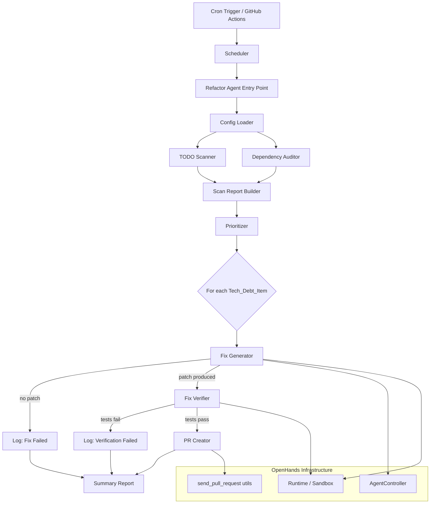

# Design Document: Tech Debt Collector ("Refactor")

## Overview

The Tech Debt Collector adds a background maintenance agent to the Nunzi platform. It follows the same architectural pattern as `openhands/resolver/` (which resolves GitHub issues) but targets accumulated tech debt: TODO comments and outdated dependencies. The agent runs on a cron schedule (nights/weekends), scans the codebase, prioritizes findings, generates fixes using the OpenHands AgentController, verifies them in a sandbox, and opens pull requests.

The implementation lives in a new `openhands/refactor/` module with a companion GitHub Actions workflow. It reuses the existing `Runtime`, `AgentController`, and `send_pull_request` infrastructure from the resolver module.

## Architecture



## Components and Interfaces

### 1. GitHub Actions Workflow (`refactor-tech-debt.yml`)

A GitHub Actions workflow triggered by `schedule` events (cron). Installs OpenHands, invokes the Refactor Agent entry point, and uploads the summary report as an artifact.

**Inputs**: `LLM_MODEL`, `LLM_API_KEY`, `PAT_TOKEN`
**Cron**: Configurable, default `0 2 * * 6` (2 AM UTC Saturday)

### 2. Refactor Agent Entry Point (`openhands/refactor/resolve_tech_debt.py`)

The CLI entry point, analogous to `openhands/resolver/resolve_issue.py`. Parses arguments, loads config, orchestrates the full scan-fix-verify-PR pipeline, and writes the summary report.

```python
class RefactorAgent:
    def __init__(self, config: RefactorConfig, repo_path: str, token: str) -> None: ...
    async def run(self) -> SummaryReport: ...
    async def process_item(self, item: TechDebtItem) -> ItemOutcome: ...
```

### 3. Config Loader (`openhands/refactor/config.py`)

Reads `.refactor.yml` from the repository root, validates it, and falls back to defaults on missing or invalid files.

```python
class RefactorConfig(BaseModel):
    schedule: str = "0 2 * * 6"
    exclude_paths: list[str] = [".git", "node_modules", "__pycache__", ".venv"]
    include_paths: list[str] = ["."]
    max_items_per_run: int = 10
    allowed_item_types: list[str] = ["todo", "dependency"]
    test_command: str | None = None
    reviewers: list[str] = []
    labels: list[str] = ["tech-debt"]
    max_iterations: int = 30

    @classmethod
    def load(cls, repo_path: str) -> "RefactorConfig": ...
    def to_yaml(self) -> str: ...
    @classmethod
    def from_yaml(cls, yaml_str: str) -> "RefactorConfig": ...
```

### 4. TODO Scanner (`openhands/refactor/todo_scanner.py`)

Recursively traverses source files, extracts TODO comments with context, and produces `TechDebtItem` objects.

```python
class TODOScanner:
    def __init__(self, config: RefactorConfig, repo_path: str) -> None: ...
    def scan(self) -> list[TechDebtItem]: ...
    def parse_file(self, file_path: str) -> list[TechDebtItem]: ...
    def extract_todo(self, line: str, line_number: int, file_path: str, file_lines: list[str]) -> TechDebtItem | None: ...
```

**Supported comment patterns**:
- Python/Shell: `# TODO`, `# TODO(author)`
- JavaScript/TypeScript: `// TODO`, `/* TODO */`, `// TODO(author)`

### 5. Dependency Auditor (`openhands/refactor/dependency_auditor.py`)

Parses dependency manifests, queries package registries, and flags outdated or vulnerable packages.

```python
class DependencyAuditor:
    def __init__(self, config: RefactorConfig, repo_path: str) -> None: ...
    async def audit(self) -> list[TechDebtItem]: ...
    def parse_pyproject(self, path: str) -> list[DeclaredDependency]: ...
    def parse_package_json(self, path: str) -> list[DeclaredDependency]: ...
    def parse_requirements_txt(self, path: str) -> list[DeclaredDependency]: ...
    async def check_pypi(self, package: str) -> RegistryInfo: ...
    async def check_npm(self, package: str) -> RegistryInfo: ...
    def is_outdated(self, current: str, latest: str) -> bool: ...
```

**Outdated threshold**: >1 major version behind OR >3 minor versions behind.

### 6. Prioritizer (`openhands/refactor/prioritizer.py`)

Assigns a `Priority_Score` to each `TechDebtItem` and sorts them.

```python
class Prioritizer:
    def __init__(self, repo_path: str) -> None: ...
    def prioritize(self, items: list[TechDebtItem]) -> list[TechDebtItem]: ...
    def score_dependency(self, item: TechDebtItem) -> float: ...
    def score_todo(self, item: TechDebtItem) -> float: ...
```

**Scoring factors**:
- Dependencies: security advisory (+100), major version lag (+20 per major), minor version lag (+5 per minor)
- TODOs: age in days from git blame (+0.1 per day, capped at 50), code complexity heuristic (+0-20)

### 7. Fix Generator (`openhands/refactor/fix_generator.py`)

Uses the OpenHands AgentController to generate patches for tech debt items.

```python
class FixGenerator:
    def __init__(self, config: RefactorConfig, runtime: Runtime) -> None: ...
    async def generate_fix(self, item: TechDebtItem) -> FixResult: ...
    def build_prompt(self, item: TechDebtItem) -> str: ...
```

- For TODOs: Provides the TODO text, surrounding context, and file to the agent with instructions to implement the TODO.
- For dependencies: Updates the version in the manifest and runs lock file regeneration.

### 8. Fix Verifier (`openhands/refactor/fix_verifier.py`)

Applies patches in a sandbox and runs the test suite.

```python
class FixVerifier:
    def __init__(self, config: RefactorConfig, runtime: Runtime) -> None: ...
    async def verify(self, patch: str) -> VerificationResult: ...
    def detect_test_command(self, repo_path: str) -> str: ...
```

**Test command detection** (when not configured):
1. If `pyproject.toml` exists with `[tool.pytest]` → `pytest`
2. If `package.json` has `scripts.test` → `npm test`
3. If `Makefile` has `test` target → `make test`
4. Fallback: skip verification with warning

### 9. PR Creator (`openhands/refactor/pr_creator.py`)

Creates branches, commits changes, and opens pull requests using the existing `send_pull_request` utility.

```python
class PRCreator:
    def __init__(self, config: RefactorConfig, token: str, repo: str) -> None: ...
    async def create_pr(self, item: TechDebtItem, patch: str, test_output: str) -> PRResult: ...
    def generate_branch_name(self, item: TechDebtItem) -> str: ...
    def generate_pr_title(self, item: TechDebtItem) -> str: ...
    def generate_pr_body(self, item: TechDebtItem, patch: str, test_output: str) -> str: ...
```

**Branch naming**: `refactor/todo/<short-slug>` or `refactor/dep/<package-name>`

## Data Models

All models are defined in `openhands/refactor/models.py` using Pydantic.

```python
from enum import Enum
from pydantic import BaseModel

class ItemType(str, Enum):
    TODO = "todo"
    DEPENDENCY = "dependency"

class ItemOutcome(str, Enum):
    FIXED = "fixed"
    SKIPPED = "skipped"
    FIX_FAILED = "fix_failed"
    VERIFICATION_FAILED = "verification_failed"
    ERROR = "error"

class DeclaredDependency(BaseModel):
    name: str
    current_version: str
    constraint: str
    manifest_file: str

class RegistryInfo(BaseModel):
    latest_version: str
    has_security_advisory: bool
    advisory_ids: list[str] = []

class TechDebtItem(BaseModel):
    item_type: ItemType
    file_path: str
    line_number: int | None = None
    description: str
    context: str = ""
    author: str | None = None
    priority_score: float = 0.0
    # Dependency-specific fields
    package_name: str | None = None
    current_version: str | None = None
    latest_version: str | None = None
    has_security_advisory: bool = False

    def to_json(self) -> str: ...
    @classmethod
    def from_json(cls, json_str: str) -> "TechDebtItem": ...

class FixResult(BaseModel):
    success: bool
    patch: str | None = None
    error: str | None = None

class VerificationResult(BaseModel):
    passed: bool
    test_output: str = ""
    error: str | None = None

class PRResult(BaseModel):
    success: bool
    pr_url: str | None = None
    pr_number: int | None = None
    error: str | None = None

class ItemReport(BaseModel):
    item: TechDebtItem
    outcome: ItemOutcome
    pr_result: PRResult | None = None
    error: str | None = None

class SummaryReport(BaseModel):
    repository: str
    scan_timestamp: str
    total_items_found: int
    items_processed: int
    items_fixed: int
    items_skipped: int
    items_failed: int
    item_reports: list[ItemReport]

    def to_json(self) -> str: ...
    @classmethod
    def from_json(cls, json_str: str) -> "SummaryReport": ...

class RefactorConfig(BaseModel):
    schedule: str = "0 2 * * 6"
    exclude_paths: list[str] = [".git", "node_modules", "__pycache__", ".venv"]
    include_paths: list[str] = ["."]
    max_items_per_run: int = 10
    allowed_item_types: list[str] = ["todo", "dependency"]
    test_command: str | None = None
    reviewers: list[str] = []
    labels: list[str] = ["tech-debt"]
    max_iterations: int = 30

    def to_yaml(self) -> str: ...
    @classmethod
    def from_yaml(cls, yaml_str: str) -> "RefactorConfig": ...
    @classmethod
    def load(cls, repo_path: str) -> "RefactorConfig": ...
```


## Correctness Properties

*A property is a characteristic or behavior that should hold true across all valid executions of a system — essentially, a formal statement about what the system should do. Properties serve as the bridge between human-readable specifications and machine-verifiable correctness guarantees.*

### Property 1: TechDebtItem JSON round-trip

*For any* valid `TechDebtItem` object, serializing it to JSON and then deserializing the JSON string back SHALL produce an object equivalent to the original.

**Validates: Requirements 1.6, 1.7**

### Property 2: TODO extraction correctness

*For any* source file containing one or more TODO comments (with or without author tags), the TODO_Scanner SHALL extract each TODO with the correct file path, line number, full comment text, and author name (when an author tag is present).

**Validates: Requirements 1.2, 1.3**

### Property 3: Multi-syntax TODO detection

*For any* TODO comment written in Python (`#`), JavaScript/TypeScript (`//`, `/* */`), or shell (`#`) comment syntax, the TODO_Scanner SHALL detect and extract the TODO.

**Validates: Requirements 1.4**

### Property 4: Exclusion pattern filtering

*For any* set of exclusion patterns in the Refactor_Config and any directory structure, no file matching an exclusion pattern SHALL appear in the scan results produced by the TODO_Scanner.

**Validates: Requirements 1.1**

### Property 5: Dependency manifest parsing

*For any* valid `pyproject.toml`, `package.json`, or `requirements.txt` file containing declared dependencies, the Dependency_Auditor SHALL extract all declared dependency names and version constraints.

**Validates: Requirements 2.1**

### Property 6: Outdated version detection threshold

*For any* pair of semantic versions (current, latest), the `is_outdated` function SHALL return `true` if and only if the current version is more than 1 major version behind OR more than 3 minor versions behind the latest version.

**Validates: Requirements 2.3**

### Property 7: Security advisory priority boost

*For any* two dependency `TechDebtItem` objects that are identical except one has `has_security_advisory=True` and the other has `has_security_advisory=False`, the item with the security advisory SHALL have a strictly higher Priority_Score.

**Validates: Requirements 2.4, 3.2**

### Property 8: Priority score assignment and descending sort

*For any* list of `TechDebtItem` objects after prioritization, every item SHALL have a Priority_Score assigned, and the list SHALL be sorted in descending order of Priority_Score (each item's score >= the next item's score).

**Validates: Requirements 3.1, 3.4**

### Property 9: Max items per run limit

*For any* Scan_Report and Refactor_Config with a `max_items_per_run` value of N, the number of items processed by the Refactor_Agent SHALL be at most N.

**Validates: Requirements 3.5**

### Property 10: Branch name format

*For any* `TechDebtItem`, the generated branch name SHALL match the pattern `refactor/<item-type>/<short-description>` where `<item-type>` is either `todo` or `dep`.

**Validates: Requirements 5.3**

### Property 11: Exit code to verification mapping

*For any* test suite execution, a zero exit code SHALL map to `VerificationResult.passed=True` and any non-zero exit code SHALL map to `VerificationResult.passed=False`.

**Validates: Requirements 6.3, 6.4**

### Property 12: PR content completeness

*For any* `TechDebtItem` and associated patch and test output, the generated PR title SHALL contain a description of the resolved item, and the PR body SHALL contain the original TODO text or dependency version info, the changes made, and the test results.

**Validates: Requirements 7.2, 7.3**

### Property 13: Summary report completeness

*For any* set of `ItemReport` objects from a run, the `SummaryReport` SHALL contain all item reports, and `items_fixed + items_skipped + items_failed` SHALL equal `items_processed`.

**Validates: Requirements 7.6**

### Property 14: RefactorConfig YAML round-trip

*For any* valid `RefactorConfig` object, serializing it to YAML and then deserializing the YAML string back SHALL produce an object equivalent to the original.

**Validates: Requirements 8.5, 8.6**

## Error Handling

| Scenario | Component | Behavior |
|---|---|---|
| GitHub API unreachable | Dependency_Auditor | Log error, skip unreachable registry, continue with remaining dependencies (Req 2.5) |
| Invalid `.refactor.yml` | Config Loader | Log warning, fall back to default configuration (Req 8.4) |
| Missing `.refactor.yml` | Config Loader | Use default configuration silently (Req 8.2) |
| Lock file exists | Refactor_Agent | Skip run, log warning (Req 4.5) |
| Fix generation fails after max iterations | Fix_Generator | Skip item, log failure, continue to next item (Req 5.4) |
| Sandbox fails to initialize | Fix_Verifier | Log error, skip current item, continue (Req 6.5) |
| Test suite fails after patch | Fix_Verifier | Mark fix as failed, discard patch, continue (Req 6.4) |
| Package registry timeout | Dependency_Auditor | Treat as unreachable, skip with warning |
| Git push fails | PR_Creator | Log error, mark item as failed in summary |

All errors are non-fatal at the item level — the agent continues processing remaining items and reports all outcomes in the summary.

## Testing Strategy

### Property-Based Testing

- Library: **Hypothesis** (Python)
- Minimum 100 iterations per property test
- Each test tagged with: `Feature: tech-debt-collector, Property {N}: {title}`
- Properties 1–14 from the Correctness Properties section are each implemented as a single Hypothesis test

### Unit Testing

Unit tests complement property tests by covering:
- Specific examples of TODO comment formats (edge cases like multi-line TODOs, nested comments)
- Config loading with specific YAML files (valid, invalid, missing)
- Lock file detection (exists, doesn't exist, stale)
- Version comparison edge cases (pre-release versions, build metadata)
- PR title/body generation with specific item types

### Integration Testing

- End-to-end scan of a fixture repository with known TODOs and outdated deps
- Fix generation with mocked AgentController
- Sandbox verification with mocked Runtime
- PR creation with mocked GitHub API

### Test File Structure

```
tests/unit/test_refactor_models.py        # Property tests for models (P1, P14)
tests/unit/test_refactor_todo_scanner.py   # Property tests for scanner (P2, P3, P4)
tests/unit/test_refactor_dep_auditor.py    # Property tests for auditor (P5, P6)
tests/unit/test_refactor_prioritizer.py    # Property tests for prioritizer (P7, P8, P9)
tests/unit/test_refactor_fix_generator.py  # Property tests for branch naming (P10)
tests/unit/test_refactor_fix_verifier.py   # Property tests for verification (P11)
tests/unit/test_refactor_pr_creator.py     # Property tests for PR content (P12, P13)
tests/unit/test_refactor_config.py         # Unit tests for config loading
```
